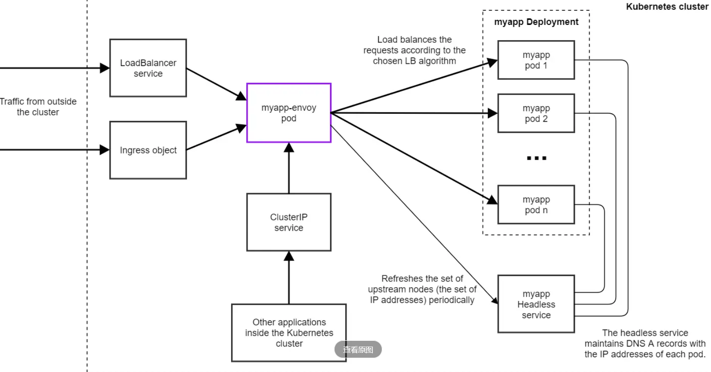

在 Kubernetes 中使用 Envoy 作为负载均衡器通常涉及以下步骤：

# 架构图


# 具体实现

在 Kubernetes 中使用 Envoy 作为负载均衡器通常涉及以下步骤：

1. **创建 Envoy 部署：** 首先，你需要在 Kubernetes 中创建一个 Envoy 的 Deployment，这将运行 Envoy 代理的实例。你可以使用 YAML 文件定义 Deployment，确保在容器规范中将 Envoy 作为容器运行。

   ```yaml
   apiVersion: apps/v1
   kind: Deployment
   metadata:
     name: envoy-deployment
   spec:
     replicas: 1
     selector:
       matchLabels:
         app: envoy
     template:
       metadata:
         labels:
           app: envoy
       spec:
         containers:
             - name: envoy
               image: envoyproxy/envoy
               ports:
                - name: http
                  containerPort: 80 #envoy路由的端口
                - name: envoy-admin
                  containerPort: 9901 #envoy后台管理系统端口
               volumeMounts:
                - name: envoy-config-101
                  mountPath: "/etc/envoy"
                  readOnly: true
         volumes:
          - name: envoy-config-101
            configMap:
              name: envoy-config-101
              
   ```

2. **创建 Envoy 服务：** 为 Envoy 创建一个 Kubernetes Service，以便其他应用程序可以通过该 Service 连接到 Envoy 负载均衡器。这通常是一个 ClusterIP Service。

   ```yaml
   apiVersion: v1
   kind: Service
   metadata:
     name: envoy-service
   spec:
     selector:
       app: envoy
     type: NodePort
     ports:
     - protocol: TCP
       port: 9901 
       name: http
     - protocol: TCP
       port: 80 
       name: admin
   ```

3. **配置 Envoy：** 你需要提供 Envoy 配置文件，以定义路由、后端服务和其他负载均衡规则。通常，你会使用 ConfigMap 来存储 Envoy 配置。

4. **Sidecar 模式：** 另一种常见的做法是将 `Envoy 作为应用容器的 Sidecar 容器部署`，这使得每个应用容器都有一个附加的 Envoy 容器，用于处理负载均衡。

   ```yaml
   apiVersion: v1
   kind: Pod
   metadata:
     name: my-pod
   spec:
     containers:
     - name: my-app
       image: my-app-image
       ports:
       - containerPort: 8080
     - name: envoy
       image: envoyproxy/envoy
       ports:
       - containerPort: 80
   ```

5. **配置服务发现：** 为了让 Envoy 知道要负载均衡的后端服务，你需要配置服务发现。这通常包括使用 Kubernetes 的服务名和端口。
* envoy.yaml代码如下
```
admin:
  access_log_path: /tmp/admin_access.log
  address:
    socket_address: { address: 0.0.0.0, port_value: 9901 } #envoy后台系统的端口

static_resources:
  listeners:
  - name: listener_0
    address:
      socket_address: { address: 0.0.0.0, port_value: 80 } #envoy路由的端口
    filter_chains:
    - filters:
      - name: envoy.http_connection_manager
        config:
          stat_prefix: ingress_http
          route_config:
            name: local_route
            virtual_hosts:
            - name: local_service
              domains: ["*"]
              routes:
              - match: { prefix: "/" }
                route: {cluster: myapp_cluster, timeout: 60s }
          http_filters:
          - name: envoy.router
  clusters:
  - name: myapp_cluster
    connect_timeout: 0.25s
    type: STRICT_DNS
    dns_lookup_family: V4_ONLY
    lb_policy: LEAST_REQUEST
    hosts: #具体应用myapp的地址和端口
    - socket_address:
        address: 192.168.60.136
        port_value: 30021
    - socket_address:
        address: 192.168.60.146
        port_value: 30022
    health_checks:
    - timeout: 5s
      interval: 10s
      unhealthy_threshold: 2
      healthy_threshold: 2
      http_health_check:
        path: /
        expected_statuses:
          start: 200
          end: 399 
```
* kubectl create configmap envoy-config-101 --from-file=envoy.yaml

6. **监控和健康检查：** 可以配置 Envoy 以执行健康检查，并监控后端服务的可用性。这有助于确保只有健康的实例接收流量。

7. **部署应用：** 最后，将你的应用部署到 Kubernetes 集群，并确保它们使用 Envoy 服务进行负载均衡。

这是一个高级概述，实际配置和部署取决于你的具体需求和环境。你可能需要创建适合你应用程序的 Envoy 配置文件，定义路由规则，配置健康检查等。同时，Envoy 提供了丰富的文档，可以帮助你深入了解如何在 Kubernetes 中使用它作为负载均衡器。
