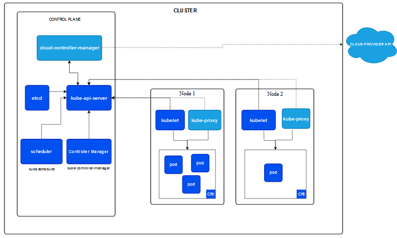

# Kubernetes 架构

# 节点

Kubernetes 通过将容器放入在节点（Node）上运行的 Pod 中来执行你的工作负载。 节点可以是一个虚拟机或者物理机器，取决于所在的集群配置。 每个节点包含运行 Pod 所需的服务； 这些节点由控制面负责管理。

通常集群中会有若干个节点；而在一个学习所用或者资源受限的环境中，你的集群中也可能只有一个节点。

节点上的组件包括 kubelet、 容器运行时以及 kube-proxy。

## Master Node
* API Server:提供了资源操作的唯一入口，并提供认证、授权、访问控制、API注册和发现等机制；
* Scheduler:负责资源的调度，按照预定的调度策略将Pod调度到相应的机器上；
* Controller Manager:负责维护集群的状态，比如故障检测、自动扩展、滚动更新等；
* etcd:保存了整个集群的状态；

## Worker Node
* Docker:创建容器的
* kubelet:负责维护容器的生命周期，同时也负责Volume（CVI）和网络（CNI）的管理；
* kube-proxy:负责为Service提供cluster内部的服务发现和负载均衡；
* kube-dns:负责为整个集群提供DNS服务
* Ingress Controller 为服务提供外网入口
* Heapster 提供资源监控
* Federation 提供跨可用区的集群
* Fluentd:主要负责日志收集、存储与查询
* Pod:是Kubernetes最基本的操作单元
