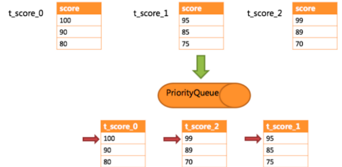

# 分库分表
## 一  什么是ShardingJDBC

定位为轻量级 Java 框架，在 Java 的 JDBC 层提供的额外服务。它使用客户端直连数据库，以 jar 包形式提供服务，无需额外部署和依赖，可理解为增强版的 JDBC 驱动，完全兼容 JDBC 和各种 ORM 框架。

适用于任何基于 JDBC 的 ORM 框架，如：JPA, Hibernate, Mybatis, Spring JDBC Template 或直接使用 JDBC；

支持任何第三方的数据库连接池，如：DBCP, C3P0, BoneCP, HikariCP 等；

支持任意实现 JDBC 规范的数据库，目前支持 MySQL，PostgreSQL，Oracle，SQLServer 以及任何可使用 JDBC 访问的数据库。

上图展示了Sharding-Jdbc的工作方式，使用Sharding-Jdbc前需要人工对数据库进行分库分表，在应用程序中加入 Sharding-Jdbc的Jar包，应用程序通过Sharding-Jdbc操作分库分表后的数据库和数据表，由于Sharding-Jdbc是对 Jdbc驱动的增强，使用Sharding-Jdbc就像使用Jdbc驱动一样，在应用程序中是无需指定具体要操作的分库和分表 的。

## 二 ShardingJDBC工作原理

### 2.1基本概念

在了解Sharding-JDBC的执行原理前，需要了解以下概念：

#### 2.1.1逻辑表

水平拆分的数据表的总称。例：订单数据表根据主键尾数拆分为10张表，分别是 t_order_0 、 t_order_1 到 t_order_9 ，他们的逻辑表名为 t_order 。

#### 2.1.2真实表

在分片的数据库中真实存在的物理表。即上个示例中的 t_order_0 到 t_order_9 。

#### 2.1.3数据节点

数据分片的最小物理单元。由数据源名称和数据表组成，例： ds_0.t_order_0 。

#### 2.1.4 绑定表

指分片规则一致的主表和子表。例如： t_order 表和 t_order_item 表，均按照 order_id 分片,绑定表之间的分区 键完全相同，则此两张表互为绑定表关系。绑定表之间的多表关联查询不会出现笛卡尔积关联，关联查询效率将大大提升。举例说明，如果SQL为：

```
SELECT i.* FROM t_order o JOIN t_order_item i ON o.order_id=i.order_id WHERE o.order_id in (10, 11);
```

在不配置绑定表关系时，假设分片键 order_id 将数值10路由至第0片，将数值11路由至第1片，那么路由后的SQL 应该为4条，它们呈现为笛卡尔积：

```
SELECT i.* FROM t_order_0 o JOIN t_order_item_0 i ON o.order_id=i.order_id WHERE o.order_id in 
(10, 11); 
SELECT i.* FROM t_order_0 o JOIN t_order_item_1 i ON o.order_id=i.order_id WHERE o.order_id in 
(10, 11); 
SELECT i.* FROM t_order_1 o JOIN t_order_item_0 i ON o.order_id=i.order_id WHERE o.order_id in 
(10, 11); 
SELECT i.* FROM t_order_1 o JOIN t_order_item_1 i ON o.order_id=i.order_id WHERE o.order_id in 
(10, 11); 
```

在配置绑定表关系后，路由的SQL应该为2条：

```
 SELECT i.* FROM t_order_0 o JOIN t_order_item_0 i ON o.order_id=i.order_id WHERE o.order_id in 
    (10, 11); 
    SELECT i.* FROM t_order_1 o JOIN t_order_item_1 i ON o.order_id=i.order_id WHERE o.order_id in 
    (10, 11); 
```

####2.1.5广播表

指所有的分片数据源中都存在的表，表结构和表中的数据在每个数据库中均完全一致。适用于数据量不大且需要与海量数据的表进行关联查询的场景，例如：字典表。

#### 2.1.6分片键

用于分片的数据库字段，是将数据库(表)水平拆分的关键字段。例：将订单表中的订单主键的尾数取模分片，则订单主键为分片字段。 SQL中如果无分片字段，将执行全路由，性能较差。 除了对单分片字段的支持，Sharding-Jdbc也支持根据多个字段进行分片。

#### 2.1.7分片算法

通过分片算法将数据分片，支持通过 = 、 BETWEEN 和 IN 分片。分片算法需要应用方开发者自行实现，可实现的灵活度非常高。包括：精确分片算法 、范围分片算法 ，复合分片算法 等。例如：where order_id = ? 将采用精确分片算法，where order_id in (?,?,?)将采用精确分片算法，where order_id BETWEEN ? and ? 将采用范围分片算法，复合分片算法用于分片键有多个复杂情况。

#### 2.1.8分片策略

包含分片键和分片算法，由于分片算法的独立性，将其独立抽离。真正可用于分片操作的是分片键 + 分片算法，也就是分片策略。内置的分片策略大致可分为尾数取模、哈希、范围、标签、时间等。由用户方配置的分片策略则更加灵活，常用的使用行表达式配置分片策略，它采用Groovy表达式表示，如: t_user_$->{u_id % 8} 表示t_user表根据u_id模8，而分成8张表，表名称为 t_user_0 到 t_user_ 7 。

#### 2.1.9自增主键生成策略

通过在客户端生成自增主键替换以数据库原生自增主键的方式，做到分布式主键无重复。

### 2.2 SQL解析

当Sharding-JDBC接受到一条SQL语句时，会陆续执行 SQL解析 => 查询优化 => SQL路由 => SQL改写 => SQL执行 => 结果归并 ，最终返回执行结果。


SQL解析过程分为词法解析和语法解析。 词法解析器用于将SQL拆解为不可再分的原子符号，称为Token。并根据不同数据库方言所提供的字典，将其归类为关键字，表达式，字面量和操作符。 再使用语法解析器将SQL转换为抽象语法树。

例如，以下SQL：

```
SELECT id, name FROM t_user WHERE status = 'ACTIVE' AND age > 18
```

解析之后的为抽象语法树见下图


为了便于理解，抽象语法树中的关键字的Token用绿色表示，变量的Token用红色表示，灰色表示需要进一步拆分。最后，通过对抽象语法树的遍历去提炼分片所需的上下文，并标记有可能需要SQL改写(后边介绍)的位置。 供分片使用的解析上下文包含查询选择项（Select Items）、表信息（Table）、分片条件（Sharding Condition）、自增主键信息（Auto increment Primary Key）、排序信息（Order By）、分组信息（Group By）以及分页信息 （Limit、Rownum、Top）。

### 2.3 SQL路由

SQL路由就是把针对逻辑表的数据操作映射到对数据结点操作的过程。

根据解析上下文匹配数据库和表的分片策略，并生成路由路径。 对于携带分片键的SQL根据分片键操作符不同可以划分为单片路由(分片键的操作符是等号)、多片路由(分片键的操作符是IN)和范围路由(分片键的操作符是BETWEEN)，不携带分片键的SQL则采用广播路由。根据分片键进行路由的场景可分为直接路由、标准路由、笛卡尔路由等。

#### 2.3.1标准路由

标准路由是Sharding-Jdbc最为推荐使用的分片方式，它的适用范围是不包含关联查询或仅包含绑定表之间关联查询的SQL。 当分片运算符是等于号时，路由结果将落入单库（表），当分片运算符是BETWEEN或IN时，则路由结果不一定落入唯一的库（表），因此一条逻辑SQL最终可能被拆分为多条用于执行的真实SQL。 举例说明，如果按照 order_id 的奇数和偶数进行数据分片，一个单表查询的SQL如下：

```
SELECT * FROM t_order WHERE order_id IN (1, 2);
```

那么路由的结果应为：

```
    SELECT * FROM t_order_0 WHERE order_id IN (1, 2); 
    SELECT * FROM t_order_1 WHERE order_id IN (1, 2);
```

绑定表的关联查询与单表查询复杂度和性能相当。举例说明，如果一个包含绑定表的关联查询的SQL如下：

```
SELECT * FROM t_order o JOIN t_order_item i ON o.order_id=i.order_id WHERE order_id IN (1, 2);
```

那么路由的结果应为：可以看到，SQL拆分的数目与单表是一致的。

```
    SELECT * FROM t_order_0 o JOIN t_order_item_0 i ON o.order_id=i.order_id WHERE order_id IN (1, 
    2); 
    SELECT * FROM t_order_1 o JOIN t_order_item_1 i ON o.order_id=i.order_id WHERE order_id IN (1, 
    2); 
```

#### 2.3.2笛卡尔路由

笛卡尔路由是最复杂的情况，它无法根据绑定表的关系定位分片规则，因此非绑定表之间的关联查询需要拆解为笛 卡尔积组合执行。 如果上个示例中的SQL并未配置绑定表关系，那么路由的结果应为：笛卡尔路由查询性能较低，需谨慎使用。

```
SELECT * FROM t_order_0 o JOIN t_order_item_0 i ON o.order_id=i.order_id WHERE order_id IN (1,
2);
SELECT * FROM t_order_0 o JOIN t_order_item_1 i ON o.order_id=i.order_id WHERE order_id IN (1,
2);
SELECT * FROM t_order_1 o JOIN t_order_item_0 i ON o.order_id=i.order_id WHERE order_id IN (1,
2);
SELECT * FROM t_order_1 o JOIN t_order_item_1 i ON o.order_id=i.order_id WHERE order_id IN (1,
2);
```

#### 2.3.3全库表路由

对于不携带分片键的SQL，则采取广播路由的方式。根据SQL类型又可以划分为全库表路由、全库路由、全实例路由、单播路由和阻断路由这5种类型。其中全库表路由用于处理对数据库中与其逻辑表相关的所有真实表的操作，主要包括不带分片键的DQL(数据查询)和DML（数据操纵），以及DDL（数据定义）等。例如：

SELECT * FROM t_order WHERE good_prority IN (1, 10);

则会遍历所有数据库中的所有表，逐一匹配逻辑表和真实表名，能够匹配得上则执行。路由后成为

```
    SELECT * FROM t_order_0 WHERE good_prority IN (1, 10); 
    SELECT * FROM t_order_1 WHERE good_prority IN (1, 10); 
    SELECT * FROM t_order_2 WHERE good_prority IN (1, 10); 
    SELECT * FROM t_order_3 WHERE good_prority IN (1, 10);
```

### 3.4.SQL改写

工程师面向逻辑表书写的SQL，并不能够直接在真实的数据库中执行，SQL改写用于将逻辑SQL改写为在真实数据库中可以正确执行的SQL。

如一个简单的例子，若逻辑SQL为：

```
SELECT order_id FROM t_order WHERE order_id=1;
```

假设该SQL配置分片键order_id，并且order_id=1的情况，将路由至分片表1。那么改写之后的SQL应该为：

```
SELECT order_id FROM t_order_1 WHERE order_id=1;
```

再比如，Sharding-JDBC需要在结果归并时获取相应数据，但该数据并未能通过查询的SQL返回。 这种情况主要是针对GROUP BY和ORDER BY。结果归并时，需要根据 GROUP BY 和 ORDER BY 的字段项进行分组和排序，但如果原始SQL的选择项中若并未包含分组项或排序项，则需要对原始SQL进行改写。 先看一下原始SQL中带有结果归并所

需信息的场景：

```
SELECT order_id, user_id FROM t_order ORDER BY user_id;
```

由于使用user_id进行排序，在结果归并中需要能够获取到user_id的数据，而上面的SQL是能够获取到user_id数据的，因此无需补列。 如果选择项中不包含结果归并时所需的列，则需要进行补列，如以下SQL：

```
SELECT order_id FROM t_order ORDER BY user_id;
```

由于原始SQL中并不包含需要在结果归并中需要获取的user_id，因此需要对SQL进行补列改写。补列之后的SQL 是：

```
SELECT order_id, user_id AS ORDER_BY_DERIVED_0 FROM t_order ORDER BY user_id;
```

### 3.5.SQL执行

Sharding-JDBC采用一套自动化的执行引擎，负责将路由和改写完成之后的真实SQL安全且高效发送到底层数据源执行。 它不是简单地将SQL通过JDBC直接发送至数据源执行；也并非直接将执行请求放入线程池去并发执行。它更关注平衡数据源连接创建以及内存占用所产生的消耗，以及最大限度地合理利用并发等问题。 执行引擎的目标是自动化的平衡资源控制与执行效率，他能在以下两种模式自适应切换：

#### 3.5.1内存限制模式

使用此模式的前提是，Sharding-JDBC对一次操作所耗费的数据库连接数量不做限制。 如果实际执行的SQL需要对某数据库实例中的200张表做操作，则对每张表创建一个新的数据库连接，并通过多线程的方式并发处理，以达成执行效率最大化。

#### 3.5.2连接限制模式

使用此模式的前提是，Sharding-JDBC严格控制对一次操作所耗费的数据库连接数量。 如果实际执行的SQL需要对某数据库实例中的200张表做操作，那么只会创建唯一的数据库连接，并对其200张表串行处理。 如果一次操作中的分片散落在不同的数据库，仍然采用多线程处理对不同库的操作，但每个库的每次操作仍然只创建一个唯一的数 据库连接。

内存限制模式适用于OLAP操作，可以通过放宽对数据库连接的限制提升系统吞吐量； 连接限制模式适用于OLTP操作，OLTP通常带有分片键，会路由到单一的分片，因此严格控制数据库连接，以保证在线系统数据库资源能够被

更多的应用所使用，是明智的选择。

### 3.6 分片策略

#### 3.6.1标准分片策略

使用场景：SQL 语句中有>，>=, <=，<，=，IN 和 BETWEEN AND 操作符，都可以应用此分片策略。

标准分片策略（StandardShardingStrategy），它只支持对单个分片健（字段）为依据的分库分表，并提供了两种分片算法 PreciseShardingAlgorithm（精准分片）和 RangeShardingAlgorithm（范围分片）。

在使用标准分片策略时，精准分片算法是必须实现的算法，用于 SQL 含有 = 和 IN 的分片处理；范围分片算法是非必选的，用于处理含有 BETWEEN AND 的分片处理。

一旦我们没配置范围分片算法，而 SQL 中又用到 BETWEEN AND 或者 like等，那么 SQL 将按全库、表路由的方式逐一执行，查询性能会很差需要特别注意。

```
    spring.shardingsphere.sharding.tables.t_order.database-strategy.standard.sharding-column=order_id
   
    spring.shardingsphere.sharding.tables.t_order.database-strategy.standard.precise-algorithm-class-name=com.xiao.sharding.algorithm.dbAlgorithm.MyDBPreciseShardingAlgorithm
```

#### 3.6.2 范围分片算法

使用场景：当我们 SQL中的分片健字段用到 BETWEEN AND操作符会使用到此算法，会根据 SQL中给出的分片健值范围值处理分库、分表逻辑。

```
SELECT * FROM t_order where  order_id BETWEEN 1 AND 100;
```

自定义范围分片算法需实现 RangeShardingAlgorithm 接口，重写 doSharding() 方法，下边我通过遍历分片健值区间，计算每一个分库、分表逻辑。

在配置上由于范围分片算法和精准分片算法，同在标准分片策略下使用，所以只需添加上 range-algorithm-class-name 自定义范围分片算法类路径即可.

```
    spring.shardingsphere.sharding.tables.t_order.database-strategy.standard.precise-algorithm-class-name=com.xiao.sharding.algorithm.dbAlgorithm.MyDBPreciseShardingAlgorithm
   
    spring.shardingsphere.sharding.tables.t_order.database-strategy.standard.range-algorithm-class-name=com.xiao.sharding.algorithm.dbAlgorithm.MyDBRangeShardingAlgorithm
```

#### 3.6.3复合分片策略

使用场景：SQL 语句中有>，>=, <=，<，=，IN 和 BETWEEN AND 等操作符，不同的是复合分片策略支持对多个分片健操作。

下面我们实现同时以 order_id、user_id 两个字段作为分片健，自定义复合分片策略。

我们先修改一下原配置，complex.sharding-column 切换成

complex.sharding-column复数，分片健上再加一个 user_id ，分片策略名变更为 complex ，complex.algorithm-class-name 替换成我们自定义的复合分片算法。

```
    spring.shardingsphere.sharding.tables.t_order.database-strategy.complex.sharding-column=order_id,user_id
    spring.shardingsphere.sharding.tables.t_order.database-strategy.complex.algorithm-class-name=com.xiao.sharding.algorithm.dbAlgorithm.MyDBComplexKeysShardingAlgorithm
```

自定义复合分片策略要实现 ComplexKeysShardingAlgorithm 接口，重新 doSharding()方法。

#### 3.6.4行表达式分片策略

行表达式分片策略（InlineShardingStrategy），在配置中使用 Groovy 表达式，提供对 SQL语句中的 = 和 IN 的分片操作支持，它只支持单分片健。

行表达式分片策略适用于做简单的分片算法，无需自定义分片算法，省去了繁琐的代码开发，是几种分片策略中最为简单的。它的配置相当简洁，这种分片策略利用inline.algorithm-expression书写表达式。

比如：ds-$->{order_id % 2} 表示对 order_id 做取模计算，$ 是个通配符用来承接取模结果，最终计算出分库ds-0 ··· ds-n，整体来说比较简单。

```
    sharding.jdbc.config.sharding.tables.t_order.database-strategy.inline.sharding-column=order_id
    sharding.jdbc.config.sharding.tables.t_order.database-strategy.inline.algorithm-expression=ds-$->{order_id % 2}
```

#### 3.6.5 Hint分片策略

Hint分片策略（HintShardingStrategy）相比于上面几种分片策略稍有不同，这种分片策略无需配置分片健，分片健值也不再从 SQL中解析，而是由外部指定分片信息，让 SQL在指定的分库、分表中执行。ShardingSphere 通过 Hint API实现指定操作，实际上就是把分片规则tablerule 、databaserule由集中配置变成了个性化配置。

举个例子，如果我们希望订单表t_order用 user_id 做分片健进行分库分表，但是 t_order 表中却没有 user_id 这个字段，这时可以通过 Hint API 在外部手动指定分片健或分片库。

使用 Hint分片策略同样需要自定义，实现 HintShardingAlgorithm 接口并重写 doSharding()方法。

自定义完算法只实现了一部分，还需要在调用 SQL 前通过 HintManager 指定分库、分表信息。由于每次添加的规则都放在 ThreadLocal 内，所以要先执行 clear() 清除掉上一次的规则，否则会报错；addDatabaseShardingValue 设置分库分片健键值，addTableShardingValue设置分表分片健键值。setMasterRouteOnly 读写分离强制读主库，避免造成主从复制导致的延迟。

// 清除掉上一次的规则，否则会报错

```
    HintManager.clear();
    // HintManager API 工具类实例
    HintManager hintManager = HintManager.getInstance();
    // 直接指定对应具体的数据库
    hintManager.addDatabaseShardingValue("ds",0);
    // 设置表的分片健
    hintManager.addTableShardingValue("t_order" , 0);
    hintManager.addTableShardingValue("t_order" , 1);
    hintManager.addTableShardingValue("t_order" , 2);
    // 在读写分离数据库中，Hint 可以强制读主库
    hintManager.setMasterRouteOnly();
```

properties 文件中配置无需再指定分片健，只需自定义的 Hint分片算法类路径即可。

```
spring.shardingsphere.sharding.tables.t_order.table-strategy.hint.algorithm-class-name=com.xiao.sharding.algorithm.tableAlgorithm.MyTableHintShardingAlgorithm
```

### 3.7.结果归并

将从各个数据节点获取的多数据结果集，组合成为一个结果集并正确的返回至请求客户端，称为结果归并。Sharding-JDBC支持的结果归并从功能上可分为遍历、排序、分组、分页和聚合5种类型，它们是组合而非互斥的关系。

归并引擎的整体结构划分如下图。


结果归并从结构划分可分为流式归并、内存归并和装饰者归并。流式归并和内存归并是互斥的，装饰者归并可以在流式归并和内存归并之上做进一步的处理。

内存归并很容易理解，他是将所有分片结果集的数据都遍历并存储在内存中，再通过统一的分组、排序以及聚合等计算之后，再将其封装成为逐条访问的数据结果集返回。

流式归并是指每一次从数据库结果集中获取到的数据，都能够通过游标逐条获取的方式返回正确的单条数据，它与数据库原生的返回结果集的方式最为契合。下边举例说明排序归并的过程，如下图是一个通过分数进行排序的示例图，它采用流式归并方式。 图中展示了3张表返回的数据结果集，每个数据结果集已经根据分数排序完毕，但是3个数据结果集之间是无序的。 将3个数据结果集的当前游标指向的数据值进行排序，并放入优先级队列，t_score_0的第一个数据值最大，t_score_2的第一个数据值次之，t_score_1的第一个数据值最小，因此优先级队列根据t_score_0，t_score_2和t_score_1的方式排序队列。



下图则展现了进行next调用的时候，排序归并是如何进行的。 通过图中我们可以看到，当进行第一次next调用时，排在队列首位的t_score_0将会被弹出队列，并且将当前游标指向的数据值（也就是100）返回至查询客户端， 并且将游标下移一位之后，重新放入优先级队列。 而优先级队列也会根据t_score_0的当前数据结果集指向游标的数据值（这里是90）进行排序，根据当前数值，t_score_0排列在队列的最后一位。 之前队列中排名第二的t_score_2的数据结果集则自动排在了队列首位。

在进行第二次next时，只需要将目前排列在队列首位的t_score_2弹出队列，并且将其数据结果集游标指向的值返回至客户端，并下移游标，继续加入队列排队，以此类推。当一个结果集中已经没有数据了，则无需再次加入队列。


可以看到，对于每个数据结果集中的数据有序，而多数据结果集整体无序的情况下，Sharding-JDBC无需将所有的数据都加载至内存即可排序。 它使用的是流式归并的方式，每次next仅获取唯一正确的一条数据，极大的节省了内存的消耗。

装饰者归并是对所有的结果集归并进行统一的功能增强，比如归并时需要聚合SUM前，在进行聚合计算前，都会通过内存归并或流式归并查询出结果集。因此，聚合归并是在之前介绍的归并类型之上追加的归并能力，即装饰者模式。

## 三 Springboot整合ShardingJDBC

git地址 https://github.com/wornxiao/sharedingjdbc-demo

```yaml
<?xml version="1.0" encoding="UTF-8"?>
    <project xmlns="http://maven.apache.org/POM/4.0.0" xmlns:xsi="http://www.w3.org/2001/XMLSchema-instance"
       xsi:schemaLocation="http://maven.apache.org/POM/4.0.0 https://maven.apache.org/xsd/maven-4.0.0.xsd">
       <modelVersion>4.0.0</modelVersion>
       <parent>
          <groupId>org.springframework.boot</groupId>
          <artifactId>spring-boot-starter-parent</artifactId>
          <version>2.2.5.RELEASE</version>
          <relativePath/> <!-- lookup parent from repository -->
       </parent>
       <groupId>com.example</groupId>
       <artifactId>sharding-test-sms</artifactId>
       <version>0.0.1-SNAPSHOT</version>
       <name>sharding-test-sms</name>
       <description>sharding-test-sms</description>
       <properties>
          <java.version>1.8</java.version>
       </properties>
       <dependencies>
          <dependency>
             <groupId>org.springframework.boot</groupId>
             <artifactId>spring-boot-starter</artifactId>
          </dependency>
          <dependency>
             <groupId>org.springframework.boot</groupId>
             <artifactId>spring-boot-starter-web</artifactId>
          </dependency>
          <dependency>
             <groupId>mysql</groupId>
             <artifactId>mysql-connector-java</artifactId>
          </dependency>
          <dependency>
             <groupId>org.mybatis.spring.boot</groupId>
             <artifactId>mybatis-spring-boot-starter</artifactId>
             <version>2.1.0</version>
          </dependency>
          <dependency>
             <groupId>com.alibaba</groupId>
             <artifactId>druid</artifactId>
             <version>1.1.9</version>
          </dependency>
          <dependency>
             <groupId>org.apache.shardingsphere</groupId>
             <artifactId>sharding-jdbc-spring-boot-starter</artifactId>
             <version>4.0.0-RC1</version>
          </dependency>
          <dependency>
             <groupId>org.projectlombok</groupId>
             <artifactId>lombok</artifactId>
             <version>1.16.18</version>
          </dependency>
          <dependency>
             <groupId>org.apache.shardingsphere</groupId>
             <artifactId>sharding-core-common</artifactId>
             <version>4.0.0-RC1</version>
          </dependency>
       </dependencies>
       <build>
          <plugins>
             <plugin>
                <groupId>org.springframework.boot</groupId>
                <artifactId>spring-boot-maven-plugin</artifactId>
             </plugin>
          </plugins>
       </build>
    </project>
```

### 3.1 库内分表(水平分表)


```yaml
t_user:
      actual-data-nodes: m2.t_user_$->{1..2} #库内分表
      table-strategy:
        inline:
          sharding-column: id
          algorithm-expression: t_user_$->{id % 2 + 1}
        key-generator:
          column: id
          type: SNOWFLAKE
          props:
            worker-id: 1
```

### 3.2 分库分表(水平分库)


```yaml
 t_order:
      actual-data-nodes: m0.t_order,m1.t_order,m2.t_order #????
      database-strategy:
        inline:
          sharding-column: id
          algorithm-expression: m$->{id % 3}
      table-strategy:
        inline:
          sharding-column: id
          algorithm-expression: t_order
        key-generator:
          column: id
          type: SNOWFLAKE

```

### 3.3 垂直分库

由于垂直分库跟服务拆分的粒度息息相关,所以垂直分库的数据库用途是根据业务来划分数据库.

### 3.4 全局表(广播表)


broadcast-tables: t_city

### 3.5 读写分离

大型的应用系统来说，将数据库拆分为主库和从库，主库负责处理事务性的增删改操作，从库负责处理查询操作，能够有效的避免由数据更新导致的行锁，使得整个系统的查询性能得到极大的改善。


通过一主多从的配置方式，可以将查询请求均匀的分散到多个数据副本，能够进一步的提升系统的处理能力。 使用多主多从的方式，不但能够提升系统的吞吐量，还能够提升系统的可用性，可以达到在任何一个数据库宕机，甚至磁盘物理损坏的情况下仍然不影响系统的正常运行。


读写分离的数据节点中的数据内容是一致的，而水平分片的每个数据节点的数据内容却并不相同。将水平分片和读写分离联合使用，能够更加有效的提升系统的性能。

Sharding-JDBC读写分离则是根据SQL语义的分析，将读操作和写操作分别路由至主库与从库。它提供透明化读写分离，让使用方尽量像使用一个数据库一样使用主从数据库集群。


Sharding-JDBC提供一主多从的读写分离配置，可独立使用，也可配合分库分表使用，同一线程且同一数据库连接内，如有写入操作，以后的读操作均从主库读取，用于保证数据一致性。Sharding-JDBC不提供主从数据库的数据同步功能，需要采用其他机制支持。

```yaml
master-slave-rules: #读写分离配置
      master:
        master-data-source-name: m0
        slave-data-source-names: m1
```

完整yml配置

```yaml
  server:
      port: 8081
    spring:
      application:
        name: spring-test-sms
      http:
        encoding:
          enabled: true
          charset: utf-8
          force: true
      shardingsphere:
        props:
          sql:
            show: true
        datasource:
          names: m2,m0,m1
          m2:
            type: com.alibaba.druid.pool.DruidDataSource
            driver: com.mysql.cj.jdbc.Driver
            url: jdbc:mysql://192.168.106.101:3306/test_sharding_user
            username: user_hllop
            password: BicfmqsrEBUjZU6tSnp25AqaA99B62vb
          m0:
            type: com.alibaba.druid.pool.DruidDataSource
            driver: com.mysql.cj.jdbc.Driver
            url: jdbc:mysql://192.168.106.101:3306/test_sharding_order
            username: user_hllop
            password: BicfmqsrEBUjZU6tSnp25AqaA99B62vb
          m1:
            type: com.alibaba.druid.pool.DruidDataSource
            driver: com.mysql.cj.jdbc.Driver
            url: jdbc:mysql://192.168.106.101:3306/test_sharding_order1
            username: user_hllop
            password: BicfmqsrEBUjZU6tSnp25AqaA99B62vb
        sharding:
          tables:
            t_item:
              actual-data-nodes: m0.t_item_$->{1..2}
              table-strategy:
                inline:
                  sharding-column: id
                  algorithm-expression: t_item_$->{id % 2 + 1}
                key-generator:
                  column: id
                  type: SNOWFLAKE
                  props:
                    worker-id: 1
            t_item_detail:
              actual-data-nodes: m0.t_item_detail_$->{1..2}
              table-strategy:
                inline:
                  sharding-column: id
                  algorithm-expression: t_item_detail_$->{id % 2 + 1}
                key-generator:
                  column: id
                  type: SNOWFLAKE
                  props:
                    worker-id: 1
            t_user:
              actual-data-nodes: m2.t_user_$->{1..2} #库内分表
              table-strategy:
                inline:
                  sharding-column: id
                  algorithm-expression: t_user_$->{id % 2 + 1}
                key-generator:
                  column: id
                  type: SNOWFLAKE
                  props:
                    worker-id: 1
            t_order:
              actual-data-nodes: m0.t_order,m1.t_order,m2.t_order #分库分表
              database-strategy:
                inline:
                  sharding-column: id
                  algorithm-expression: m$->{id % 3}
              table-strategy:
                inline:
                  sharding-column: id
                  algorithm-expression: t_order
                key-generator:
                  column: id
                  type: SNOWFLAKE
          broadcast-tables: t_city  #全局广播表
          binding-tables:  # 主子绑定表
            - t_item,t_item_detail
          #master-slave-rules: #读写分离配置
            # master:
              # master-data-source-name: m0
              # slave-data-source-names: m1
    mybatis:
      mapper-locations: classpath:mapper/*Mapper.xml
```

完节.

