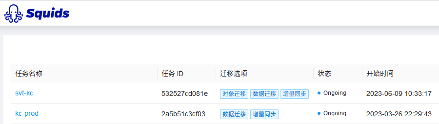

部署MySQL高可用集群需要考虑多个方面，包括数据库复制、自动故障转移和负载均衡。下面是一个常见的MySQL高可用集群部署方案和详细步骤：

1. 部署主从复制：

   - 安装MySQL数据库软件在主服务器和从服务器上。
   - 配置主服务器的`my.cnf`文件，启用二进制日志（binary log）并配置唯一的服务器ID。
   - 在从服务器的`my.cnf`文件中，配置`replica`选项，指定主服务器的IP地址和复制用户的凭据。
   - 启动主服务器和从服务器，并确保主服务器上的二进制日志正常工作，并且从服务器可以连接到主服务器并复制数据。
2. 自动故障转移：

   - 在主服务器和从服务器之外，部署一个用于监视和管理集群的第三方工具，例如MySQL Group Replication、Pacemaker或Keepalived。
   - 配置监视工具以定期检查主服务器的健康状态。
   - 如果主服务器宕机或发生故障，监视工具将自动检测到，并触发自动故障转移过程。
   - 自动故障转移过程涉及将从服务器提升为新的主服务器，并更新集群配置，以便其他从服务器连接到新的主服务器。
3. 负载均衡：

   - 在MySQL高可用集群前面，引入一个负载均衡器，例如HAProxy或MySQL Router。
   - 配置负载均衡器以侦听客户端的连接请求，并将它们分发到可用的数据库服务器。
   - 负载均衡器可以使用不同的算法（例如轮询或基于权重）来分配负载，并检测服务器的可用性以实现高可用性。

这些步骤提供了一个基本的框架，可以根据具体情况进行调整和扩展。还要注意的是，有多种工具和技术可用于实现MySQL高可用集群，所以具体的步骤可能会有所不同。在部署之前，建议详细研究所选工具的文档，并根据特定的需求进行适当的配置和定制化。

# 主从同步工具

* Squids DBMotion 以任务的方式提供了数据同步方案，可定时启停。
* 需要修改主mysql的my.cnf文件，添加binlog配置
* Squids会帮助我们建立目标源的数据库，我们不需要手动建库【对象迁移】，同步数据【数据迁移】，有新数据写入后实时同步【增量同步】

```conf
log-bin=mysql-bin
binlog-do-db=keycloak
```


# MMM集群

MMM（Master-Master Replication Manager）模式是一种MySQL高可用性解决方案，它允许多个主服务器进行双向复制，实现数据的同步和故障转移。下面是使用MMM模式部署MySQL高可用集群的详细步骤和相关代码示例：

1. 准备工作：

   - 在每个服务器上安装MySQL数据库软件。
   - 确保服务器之间可以相互通信，并且具有固定的IP地址。
2. 主从复制设置：

   - 在每个服务器上编辑MySQL的配置文件`my.cnf`，启用二进制日志（binary log）和自动增量备份（auto_increment_increment）。
   - 配置主服务器的`my.cnf`文件，设置唯一的服务器ID和二进制日志文件的位置。
   - 配置从服务器的`my.cnf`文件，指定主服务器的IP地址、复制用户的凭据以及二进制日志文件的位置。
   - 重启MySQL服务器以使配置更改生效。
3. 安装和配置MMM管理工具：

   - 在一个独立的管理节点上安装MMM工具。
   - 创建MMM的配置文件`mmm_common.conf`，包括所有服务器的IP地址和凭据。
   - 创建MMM的配置文件`mmm_masterha.conf`，指定每个服务器的角色（master或slave）和相关配置信息。
   - 在管理节点上执行以下命令，将配置文件复制到各个服务器：
     ```
     mmm_control install
     ```
4. 启动和测试MMM集群：

   - 在管理节点上执行以下命令，启动MMM集群并检查状态：
     ```
     mmm_control start
     mmm_control show
     ```
   - 确保所有服务器都成功启动，并且主服务器和从服务器之间的复制正常工作。
   - 在测试环境中模拟故障，例如关闭主服务器并观察自动故障转移是否生效。

以下是示例配置文件的代码片段，供参考：

1. 主服务器的`my.cnf`配置示例：

   ```cnf
   server-id = 1
   log-bin = /var/log/mysql/mysql-bin.log
   ```
2. 从服务器的`my.cnf`配置示例：

   ```cnf
   server-id = 2
   replicate-do-db = dbname
   master-host = <主服务器IP地址>
   master-user = <复制用户>
   master-password = <复制用户密码>
   ```
3. MMM的`mmm_common.conf`配置示例：

   ```cnf
   [server default]
   host=server1
   port=3306
   user=root
   password=secret
   ```
4. MMM的`mmm_masterha.conf`配置示例：

   ```cnf
   [server1]
   hostname=server1
   role=master
   [server2]
   hostname=server2
   role=master
   ```

这只是一个基本示例，实际部署可能需要根据具体环境和要求进行定

制。在部署之前，请确保详细研究MMM工具的文档，并根据需要进行适当的配置和调整。
