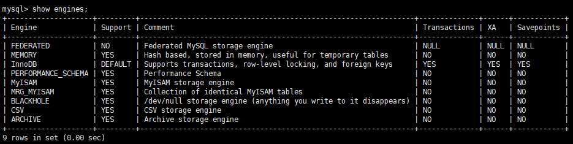

# █ 高性能 MySQL

# 一. 引擎

查看引擎支持情况

```mysql
show engines;
```



自动提交, 默认开启

```mysql
-- 查询
show variables like 'autocommit';
-- 设置, 1/on=启用, 0/off=禁用
set autocommit = 1;
```

强制提交

某些操作会强制提交当前事务, 如 DDL 中的 `alter table`. 详见 [mysql 隐式提交](https://dev.mysql.com/doc/refman/8.0/en/implicit-commit.html)

事务中混合使用存储引擎

可以为不同表指定不同的引擎, 但应注意非事务型表无法回滚, 可能到导致数据不一致

隐式/显式锁

innoDB 采用两阶段锁定协议, 会在需要的时候自动加锁, 并仅在 commit 或 rollback 的时候统一释放. 

innodb 也支持显示加锁, 属于mysql 方言, 不是 SQL 规范

```mysql
select ... lock in share mode;
select ... for update;
```

显式锁定会影响效率, 注意仅在需要时才使用. 

另外 mysql 在服务器层面也可以使用锁, 与底层存储引擎无关. 但这类锁与事务无关, 应避免使用. 

```mysql
-- 加锁
lock tables 
	table_2 [as t2] ${lock_type} 
	table_2 [as t2] ${lock_type};
-- lock_type 类型
READ [LOCAL] | [LOW_PRIORITY] WRITE
-- 解锁
unlock tables;
```

多版本并发控制 MVCC


# 二. 锁

## 1. 并发与锁

并发控制: 锁, 保证统一时间只有一个用户能写入

读锁: 共享锁, 互不干扰

写锁: 排他锁, 阻塞其他读锁和写锁

实际数据库系统中, 时刻都在发生锁定

## 2. 锁的粒度

为了提高资源共享效率, 就是让锁定对象更有选择性, 尽量只锁定需要修改的部分, 只要相互不发生冲突即可.

但操作锁也需要消耗资源, 若花费大量时间管理锁, 则系统的数据操作性能也会受影响. 

锁策略, 要在锁的开销和数据的安全性之间寻求平衡.

大多数商业数据库都是用行级锁


MyISAM

InnoDB

锁机制

索引类型

事务级别

隔离属性

传播属性

## 事务的酸碱中和


## 临时表

原始慢sql

```mysql
SELECT DISTINCT
    g.*,
    cp.name AS cp_name,
    c.name AS category_name,
    t.name AS type_name
FROM gm_game g
    LEFT JOIN gm_cp cp ON cp.id = g.cp_id AND cp.deleted = 0
    LEFT JOIN gm_category c ON c.id = g.category_id AND c.deleted = 0
    LEFT JOIN gm_type t ON t.id = g.type_id AND t.deleted = 0
WHERE g.deleted = 0
ORDER BY g.modify_time DESC
LIMIT 20
```

分解

```mysql
-- 第一条语句：查询符合条件的数据，只需要查询g.id即可
SELECT DISTINCT 
	g.id 
FROM gm_game g 
    LEFT JOIN gm_cp cp ON cp.id = g.cp_id AND cp.deleted = 0 
    LEFT JOIN gm_category c ON c.id = g.category_id AND c.deleted = 0 
    LEFT JOIN gm_type t ON t.id = g.type_id AND t.deleted = 0 
WHERE g.deleted = 0 
ORDER BY g.modify_time DESC 
LIMIT 20;

-- 第二条语句：查询符合条件的详细数据，将第一条sql的结果使用in操作拼接到第二条的sql
SELECT DISTINCT 
    g.*, 
    cp.name AS cp_name,
    c.name AS category_name,
    t.name AS type_name 
FROM gm_game g 
    LEFT JOIN gm_cp cp ON cp.id = g.cp_id AND cp.deleted = 0 
    LEFT JOIN gm_category c ON c.id = g.category_id AND c.deleted = 0 
    LEFT JOIN gm_type t ON t.id = g.type_id AND t.deleted = 0 
WHERE g.deleted = 0 and g.id in(…………………) 
ORDER BY g.modify_time DESC ;
```


# █ 集群, 分布式

# 一. 分表

# 二. 分库

# 三. 主从备份

# 四. 读写分离


