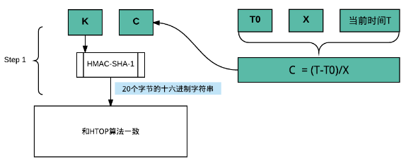

# 摘要
本文根据 RFC4226 和 RFC6238 文档，详细的介绍 HOTP 和 TOTP 算法的原理和实现。

两步验证已经被广泛应用于各种互联网应用当中，用来提供安全性。对于如何使用两步验证，大家并不陌生，无非是开启两步验证，然后出现一个二维码，使用支持两步验证的移动应用比如 Google Authenticator 或者 LassPass Authenticator 扫一下二维码。这时候应用会出现一个6位数的一次性密码，首次需要输入验证从而完成开启过程。以后在登陆的时候，除了输入用户名和密码外，还需要把当前的移动应用上显示的6位数编码输入才能完成登陆。

这个过程的背后主要由两个算法来支撑：HOTP 和 TOTP。也分别对应着两份 RFC 协议 RFC4266 和 RFC6238。前者是 HOTP 的标准，后者是 TOTP 的标准。本文将使用图文并茂的方式详细介绍 HOTP 和 TOTP 的算法原理，并在最后分析其安全性。当然所有内容都是基于协议的，通过自己的理解更加直观的表达出来。

# 协议解决的核心问题
通过前面两步验证的使用场景分析，不难看出问题的核心在于如何能够让用户手机应用产生的验证码和服务器产生的验证码一致，或者是在一定范围内一致。参考下图：


所以我们的算法就是在解决如何更好的生成这个验证码，既能保证服务器端和客户端同步，还能保证验证码不重复并且不容易被别人反向破解出共享密钥。其中如果是计数，则是 HOTP， 如果是使用时间来生成验证码，则是 TOTP。

# HOTP 算法图解
## 符号定义
对于 HOTP，通过上图我们已经看到输入算法的主要有两个元素，一个是共享密钥，另外一个是计数。在 RFC 算法中用一下字母表示：
* K 共享密钥，这个密钥的要求是每个 HOTP 的生成器都必须是唯一的。一般我们都是通过一些随机生成种子的库来实现。
* C 计数器，RFC 中把它称为移动元素（moving factor）是一个 8个 byte的数值，而且需要服务器和客户端同步。
另外一个参数比较好理解，
* Digit 表示产生的验证码的位数
最后两个参数可能暂时不好理解，我们先放在这，等用到在解释
* T 称为限制参数（Throttling Parameter）表示当用户尝试 T 次 OTP 授权后不成功将拒绝该用户的连接。
* s 称为重新同步参数（Resynchronization Parameter）表示服务器将通过累加计数器，来尝试多次验证输入的一次性密码，而这个尝试的次数及为 s。该参数主要是有效的容忍用户在客户端无意中生成了额外不用于验证的验证码，导致客户端和服务端不一致，但同时也限制了用户无限制的生成不用于验证的一次性密码。

## 算法流程


核心步骤主要是使用 K C 和 Digit。
* 第一步：使用 HMAC-SHA-1 算法基于 K 和 C 生成一个20个字节的十六进制字符串（HS）。关于如何生成这个是另外一个协议来规定的，RFC 2104 HMAC Keyed-Hashing for Message Authentication. 实际上这里的算法并不唯一，还可以使用 HMAC-SHA-256 和 HMAC-SHA-512 生成更长的序列。对应到协议中的算法标识就是
HS = HMAC-SHA-1(K,C)
 
* 第二步：选择这个20个字节的十六进制字符串（HS 下文使用 HS 代替 ）的最后一个字节，取其低4位数并转化为十进制。比如图中的例子，最后的字节是 5a，第四位就是 a，十六进制也就是 0xa，转化为十进制就是 10。该数字我们定义为 Offset，也就是偏移量。

* 第三步：根据偏移量 Offset，我们从 HS 中的第 10（偏移量）个字节开始选取 4 个字节，作为我们生成 OTP 的基础数据。图中例子就是选择 50ef7f19，十六进制表示就是 0x50ef7f19，我们成为 Sbits
以上两步在协议中的成为 Dynamic Truncation （DT）算法，具体参考以下伪代码：
```
Let Sbits = DT(HS)  // DT, defined below,
// returns a 31-bit string

展开就是
DT(String) // String = String[0]...String[19]
Let OffsetBits be the low-order 4 bits of String[19]
Offset = StToNum(OffsetBits) // 0 <= OffSet <= 15
Let P = String[OffSet]...String[OffSet+3]
Return the Last 31 bits of P
```

* 第四步：将上一步4个字节的十六进制字符串 Sbits 转化为十进制，然后用该十进制数对 10的Digit次幂 进行取模运算。其原理很简单根据取模运算的性质，比如 比10大的数 MOD 10 结果必然是 0到9， MOD 100 结果必然是 0-99。图中的例子，50ef7f19 转化为十进制为 1357872921，然后如果需要6位 OTP 验证码，则 1357872921 MOD 10^6 = 872921。 872921 就是我们最终生成的 OTP。
对应到协议中的算法为：
```
Let Snum = StToNum(Sbits) // Convert S to a number in
// 0...2^{31}-1

Return D = Snum mod 10^Digit // D is a number in the range
// 0...10^{Digit}-1
```
这一步可能还需要注意一点就是图中案例 Digit 不能超过10，因为即使超过10，
1357872921 取模后也不会超过10位了。所以如果我们希望获取更长的验证码，需要在三步中拿到更多的十六进制字节，从而得到更大的十进制数。这个十进制决定了生成的 OTP 编码的长度。

# TOTP 算法图解

在 HOTP 算法的基础上，对于 TOTP 算法的解释是不难了，因为 TOTP 实际上是基础 HOTP 的，只不过 HOTP 的计数器在 TOTP 中不再是直接的计数器了，而是使用时间来简介计数的。下图将会详细介绍 TOTP 是如何在 HOTP 基础上使用时间来计数的。

## 符号定义
时间窗口 X ：表示多长时间算作计数器的一步，通常会设为30秒
初始计数时间戳 $T_0$： 使用 Unix 时间戳来表示 OTP 生成的时候的初始计数时间。

## 算法流程
TOTP 算法的关键在于如何更具当前时间和时间窗口计算出计数，也就是如何根据当前时间和 X 来计算 HOTP 算法中的 C。



HOTP 算法中的 C 是使用当前 Unix 时间戳减去初始计数时间戳，然后除以时间窗口而获得的。

## 算法安全性分析
上一节我们的算法中有两个参数没有用，T 和 s。这两个参数对安全有重要的作用。
官方协议在这里给出了5点安全要求，其中第一点是协议本身的要求，理论上进行约束，我们主要关心另外4点，分别是 HOTP 的验证，限制访问参数，重新同步参数以及共享密钥的管理。
对于二步验证的安全问题实际上就是如何保证第二步验证尽可能不被攻击的前提下向用户提供更方便的服务。

通过下图我们可以详细的了解 HOTP 的验证过程，同时还可以了解参数 s 和 T 的用途。


如果用户严格按照生成一次 OTP，然后验证一次的话，服务器直接可以验证成功。因为算法将会输入相同的参数。

如果用户无意间多生成了若干次 OTP 但是没有用来验证，服务器和客户端就产生差异，这时候服务器端会自动累积计数器来尝试匹配用户输入的 OTP，但是这种尝试是有限制的，这也就是前面说到的参数 s 的作用。一旦服务器尝试 s 次仍未匹配成功，那么就会通知客户端需要重新生成验证来验证，只要验证成功。

协议中对于参数 s 给出的建议是：服务器建议设置该参数，但是在保证可用性的前提下，尽可能小。另外还可以要求用户输入一个 HOTP 序列（比如连续生成多个 OTP 发送到服务器进行验证）来进行重新同步计数器。

既然涉及到重试，服务器同样对重试次数有所限制，从而防止暴力破解。这里当用户重试次数超过了阈值 T，服务器就应该将该账号标记为有安全风险，需要提醒用户。

协议中对个参数 T 给出的建议是：同样 T 也不建议设的很大。另外还提供了另外一个基于延时的策略还防止暴力破解攻击，服务器设置一个惩罚时间，一旦用户验证失败，需要在惩罚时间乘以失败次数的时间内禁止用户重新尝试验证。这个延时需要跨不同的登陆会话，以防止并发的攻击。

# 总结
通过上面的图解，基本解释了 HOTP 和 TOTP 两种算法的关键步骤，并且通过验证的场景对其安全要求进行了分析。
