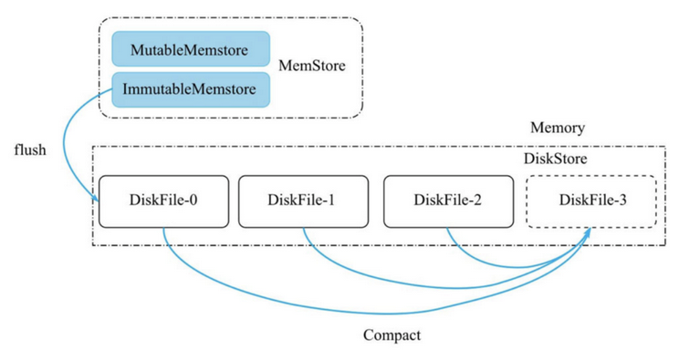
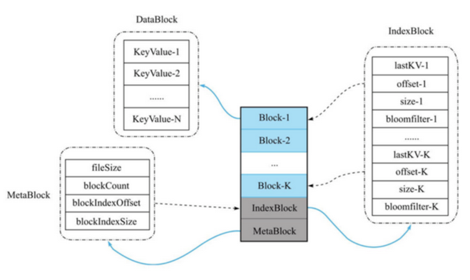

# 核心

如何从很多硬盘文件中快速找到你要找的文件

# 结构

MiniBase是一个标准的LSM树索引结构，分内存部分和磁盘部分。



* MemStore 客户端不断地写入数据，当MemStore的内存超过一定阈值时，MemStore会flush成一个磁盘文件

  * MutableMemstore 由一个ConcurrentSkipListMap组成，`kvMap`可读和写
  * MutableMemstore 由一个ConcurrentSkipListMap组成，`snapshot`只能读
  * 这里设计两个小的MemStore，是为了防止在flush的时候，MiniBase无法接收新的写入。假设只有一个MutableMemstore，那么一旦进入flush过程，MutableMemstore就无法写入，而此时新的写入就无法进行。
* DiskStore
  **基本概念**
* DiskStore，由多个DiskFile组成，每一个DiskFile就是一个磁盘文件。
* ImmutableMemstore执行完flush操作后，就会生成一个新的DiskFile，存放到DiskStore中.
* 为了有效控制DiskStore中的DiskFile个数，我们为MiniBase设计了Compaction策略。目前的Compaction策略非常简单——当DiskStore的DiskFile数量超过一个阈值时，就把所有的DiskFile进行Compact，最终合并成一个DiskFile。
  **核心问题与结构设计**
* DiskFile 必须支持高效的写入和读取
  * 由于MemStore的写入是顺序写入，如果flush速度太慢，则可能会阻塞后续的写入，影响写入吞吐，因此flush操作最好也设计成顺序写。
  * LSM树是一种磁盘数据的索引结果，它的劣势就是读取性能会有所牺牲，如果在DiskFile上能实现高效的数据索引，则可以大幅提升读取性能，例如考虑布隆过滤器设计。
  * LSM树擅长顺序写，所以支持大批量的写入
  * LSM一般由两部分组成，内存部分和磁盘部分，内存部分一般采用跳跃表，硬盘部分一般是多个内部k/v有序的文件组成
* DiskFile的数据必须分成众多小块(内存小磁盘大)
  * 一次IO操作只读取一小部分的数据
  

DiskFile由3种类型的数据块组成，分别是DataBlock、IndexBlock、MetaBlock。

* DiskFile组成
  * IndexBlock 一个DiskFile内有且仅有一个IndexBlock,它主要存储多个DataBlock的索引数据
    * astKV ：该DataBlock的最后一个KV。方便直接读取这个DataBlock到内存。为什么不是第一个kv?
    * offset ：该DataBlock在DiskFile中的偏移位置，查找时，用offset值去文件中Seek，并读取DataBlock的数据。
    * size：该DataBlock占用的字节长度。
    * bloomFilter：该DataBlock内所有KeyValue计算出的布隆过滤器字节数组。
  * MetaBlock 一个DiskFile中有且仅有一个MetaBlock；同时MetaBlock是定长的
    * fileSize ：该DiskFile的文件总长度，可以通过对比这个值和当前文件真实长度，判断文件是否损坏
    * blockCount：该DiskFile拥有的Block数量
    * blockIndexOffset：该DiskFile内的IndexBlock的偏移位置，方便定位到IndexBlock。
    * blockIndexSize：IndexBlock的字节长度。
  * DataBlock
    * 主要用来存储有序的KeyValue集合——KeyValue-1，KeyValue-2，…，KeyValue-N
    * 一个DiskFile内可能有多个Block，具体的Block数量取决于文件内存储的总KV数据量

### How to use ?

```
Config conf = new Config().setDataDir(dataDir).setMaxMemstoreSize(1).setFlushMaxRetries(1)
    .setMaxDiskFiles(10);
final MiniBase db = MStore.create(conf).open();

// Put
db.put(Bytes.toBytes(1), Bytes.toBytes(1));

// Scan
Iter<KeyValue> kv = db.scan();
while (kv.hasNext()) {
    KeyValue kv = kv.next();
    //...
}
```

### How to build and test?

```shell
git clone git@github.com:openinx/minibase.git
mvn clean package
```
