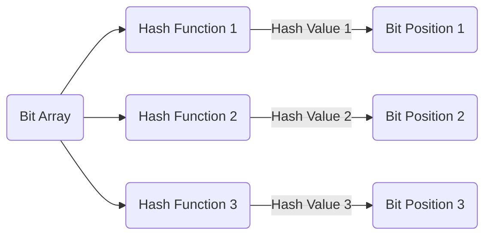

布隆过滤器（Bloom Filter）是一种高效的概率数据结构，用于判断一个元素是否存在于集合中。它基于位数组和多个哈希函数，并具有以下特点：

> Bloom Filter 是一个基于概率的数据结构：它只能告诉我们一个**元素绝对不在集合内**或**可能在集合内**

1. 快速查询：布隆过滤器具有快速查询的特性。它使用多个哈希函数将元素映射到位数组中的不同位置，查询时只需通过计算哈希值并检查对应的位是否被设置，即可判断元素是否可能存在于集合中。
2. 空间效率高：布隆过滤器占用的存储空间相对较小。通过合理选择位数组的大小和哈希函数的数量，可以在较小的空间内存储大量的元素信息。
3. 容错率可控：布隆过滤器可以通过调整位数组的大小和哈希函数的数量来控制容错率。容错率是指判断元素存在时的误判率，即可能将不存在的元素错误地判断为存在。较小的容错率会增加位数组的大小和哈希函数的数量。
4. 不支持删除操作：布隆过滤器设计用于快速判断元素是否存在，但本身不支持删除操作。删除操作会导致位数组中的其他元素受到影响，可能会误判其他元素的存在性。

布隆过滤器适用于以下场景：

- 快速成员检查：当需要快速判断一个元素是否存在于一个庞大的集合中时，布隆过滤器可以提供高效的成员检查功能。例如，网络爬虫可以使用布隆过滤器来避免重复爬取同一网页。
- 缓存优化：布隆过滤器可以用于缓存系统中，提前过滤掉不会命中的数据，以减轻对后端存储的负载。
- 防止缓存穿透：布隆过滤器可以用于防止缓存穿透，即当请求的数据不存在时，快速判断避免对底层存储进行无效查询。
- 数据库查询优化：布隆过滤器可以用于减少数据库查询操作。例如，在一个查询系统中，可以使用布隆过滤器过滤掉一些明显不符合条件的查询，从而提高整体查询效率。

需要注意的是，布隆过滤器存在一定的误判率。由于多个元素可能哈希到同一位，因此在判断元素存在时，可能会发生冲突，导致错误的判断。因此，在使用布隆过滤器时，需要根据实际需求权衡容错率和空间占用，并在误判率可接受的范围内进行使用。

下面是一个使用 Mermaid 构建的 Markdown 结构图，展示了布隆过滤器的基本结构：

在这个结构图中，布隆过滤器由三个主要组件组成：

- Bit Array（位数组）：用于存储元素的存在性信息。位数组是一个由多个位（或者说是二进制位）组成的数组，每个位代表一个位置。位数组的长度通常根据期望存储的元素数量和容错率进行选择。
- Hash Functions（哈希函数）：布隆过滤器使用多个哈希函数来将元素映射到位数组的不同位置。在结构图中，我们表示了三个哈希函数，分别为 Hash Function 1、Hash Function 2 和 Hash Function 3。
- Bit Positions（位位置）：通过哈希函数计算得到的哈希值将决定元素在位数组中的位置。在结构图中，我们用 E、F 和 G 来表示位数组中的不同位位置。

当要向布隆过滤器中添加元素时，首先通过多个哈希函数计算元素的哈希值，然后将对应的位位置在位数组中设置为 1，表示元素的存在性。

当要查询一个元素是否存在于布隆过滤器中时，同样通过多个哈希函数计算元素的哈希值，并检查对应的位位置是否都为 1。如果所有位位置都为 1，则可能存在这个元素；如果有任何一个位位置为 0，则可以确定该元素不存在。

请注意，上述结构图只是一个简化的表示，用于展示布隆过滤器的基本结构。实际的布隆过滤器还包括其他的配置参数和操作方法，例如位数组的大小、哈希函数的数量等。
