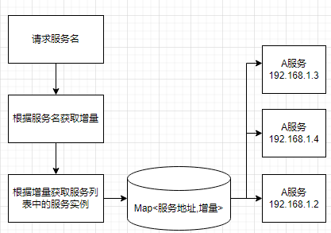
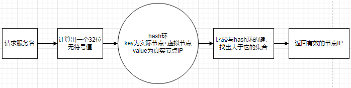

# 负载均衡

1. 轮询算法(Round Robin)
2. 随机算法(Random)
3. 加权轮询（Weighted Round Robin）算法
4. 一致性hash算法
5. LFU最不经常使用算法(Least Frequently Used)
6. LRU最近最少使用算法(Least Recently Used)

# 1. 轮询（Round Robin）算法：

这是最简单的负载均衡算法之一，它按顺序将请求分发给每个可用的服务器。当请求到达时，它将被分发给下一个服务器，然后循环重复此过程。


```java
/**
 * 轮询
 *
 */
public class RpcLoadBalanceRoundStrategy extends RpcLoadBalance {

    private ConcurrentMap<String, AtomicInteger> routeCountEachJob = new ConcurrentHashMap<String, AtomicInteger>();

    private long CACHE_VALID_TIME = 0;

    private int count(String serviceKey) {
        // cache clear
        if (System.currentTimeMillis() > CACHE_VALID_TIME) {
            routeCountEachJob.clear();
            CACHE_VALID_TIME = System.currentTimeMillis() + 24 * 60 * 60 * 1000;
        }

        // count++
        AtomicInteger count = routeCountEachJob.get(serviceKey);
        if (count == null || count.get() > 1000000) {
            // 初始化时主动Random一次，缓解首次压力
            count = new AtomicInteger(new Random().nextInt(100));
        }
        else {
            // count++
            count.addAndGet(1);
        }

        routeCountEachJob.put(serviceKey, count);
        return count.get();
    }

    @Override
    public String route(String serviceKey, TreeSet<String> addressSet) {
        // arr
        String[] addressArr = addressSet.toArray(new String[addressSet.size()]);

        // round
        String finalAddress = addressArr[count(serviceKey) % addressArr.length];
        return finalAddress;
    }

}
```

# 2. 随机（Random）算法：

这种算法通过随机选择一个可用服务器来分发请求。

```java
/**
 * 随机
 *
 */
public class RpcLoadBalanceRandomStrategy extends RpcLoadBalance {

    private Random random = new Random();

    @Override
    public String route(String serviceKey, TreeSet<String> addressSet) {
        // arr
        String[] addressArr = addressSet.toArray(new String[addressSet.size()]);

        // random
        String finalAddress = addressArr[random.nextInt(addressSet.size())];
        return finalAddress;
    }

}
```

# 3. 加权轮询（Weighted Round Robin）算法：

这种算法根据服务器的权重值来分配请求。具有更高权重值的服务器将获得更多的请求。

```java
import java.util.ArrayList;
import java.util.List;

public class WeightedRoundRobinLoadBalancer {
    private List<Server> servers;
    private int currentIndex;

    public WeightedRoundRobinLoadBalancer() {
        this.servers = new ArrayList<>();
        this.currentIndex = 0;
    }

    public void addServer(Server server) {
        servers.add(server);
    }

    public String getNextServer() {
        if (servers.isEmpty()) {
            return null;
        }

        int totalWeight = servers.stream().mapToInt(Server::getWeight).sum();
        int serverCount = servers.size();

        while (true) {
            Server server = servers.get(currentIndex);
            if (server.getWeight() >= totalWeight) {
                server.setWeight(server.getWeight() - totalWeight);
                currentIndex = (currentIndex + 1) % serverCount;
                return server.getName();
            }
            currentIndex = (currentIndex + 1) % serverCount;
        }
    }
}

class Server {
    private String name;
    private int weight;

    public Server(String name, int weight) {
        this.name = name;
        this.weight = weight;
    }

    public String getName() {
        return name;
    }

    public int getWeight() {
        return weight;
    }

    public void setWeight(int weight) {
        this.weight = weight;
    }
}
```

# 4. 一致性hash算法

hash主要是对key进行32位的md5之后，对每个字节再进行一次位移运算，最后再进行截取计算，保证结果在0xffffffffL的范围内(每两位16进制数为一个字节，
8位16进制共占用4字节的空间，即unsignedInt32的最大值，它需要使用long类型来表示，因为java里没有无符号的类型)，然后再对这个结果进行取模运算，得到的结果
就是对应的服务器地址。


```java
public class RpcLoadBalanceConsistentHashStrategy extends RpcLoadBalance {

    private int VIRTUAL_NODE_NUM = 100;

    /**
     * get hash code on 2^32 ring (md5散列的方式计算hash值)
     * @param key
     * @return
     */
    public long hash(String key) {

        // md5 byte
        MessageDigest md5;
        try {
            md5 = MessageDigest.getInstance("MD5");
        }
        catch (NoSuchAlgorithmException e) {
            throw new RuntimeException("MD5 not supported", e);
        }
        md5.reset();
        byte[] keyBytes = null;
        try {
            keyBytes = key.getBytes("UTF-8");
        }
        catch (UnsupportedEncodingException e) {
            throw new RuntimeException("Unknown string :" + key, e);
        }

        md5.update(keyBytes);
        byte[] digest = md5.digest();

        // 将一个长度为 4 的字节数组 digest 转换为一个 32 位的整数值
        // (digest[3] & 0xFF)：这一步将 digest 数组的第 4 个字节与 0xFF 进行按位与操作，得到一个无符号的 8 位整数值。这是为了确保字节的符号位被清除，只保留字节的值。
       // (long) (digest[3] & 0xFF) << 24：将上一步得到的无符号整数值左移 24 位，将其放置在最高位（高字节）位置上。这样可以将其转换为一个 32 位整数的高字节部分
        long hashCode = ((long) (digest[3] & 0xFF) << 24) | ((long) (digest[2] & 0xFF) << 16)
                | ((long) (digest[1] & 0xFF) << 8) | (digest[0] & 0xFF);

        long truncateHashCode = hashCode & 0xffffffffL;
        return truncateHashCode;
    }

    public String doRoute(String serviceKey, TreeSet<String> addressSet) {

        // ------A1------A2-------A3------
        // -----------J1------------------
        TreeMap<Long, String> addressRing = new TreeMap<Long, String>();
        for (String address : addressSet) {
            for (int i = 0; i < VIRTUAL_NODE_NUM; i++) {
                long addressHash = hash("SHARD-" + address + "-NODE-" + i);
                addressRing.put(addressHash, address);
            }
        }

        long jobHash = hash(serviceKey);
        SortedMap<Long, String> lastRing = addressRing.tailMap(jobHash); // 返回其键大于或等于fromKey的部分视图
        if (!lastRing.isEmpty()) {
            return lastRing.get(lastRing.firstKey());
        }
        return addressRing.firstEntry().getValue();
    }

    @Override
    public String route(String serviceKey, TreeSet<String> addressSet) {
        String finalAddress = doRoute(serviceKey, addressSet);
        return finalAddress;
    }

} 
```

# 5. LFU最不常使用(Least Frequently Used)

LFU（最少使用）算法根据数据项被访问的频率来进行淘汰。它维护一个计数器，记录每个数据项被访问的次数。当缓存空间不足时，LFU算法会淘汰访问频率最低的数据项。
这样可以确保缓存中保留的是最常被访问的数据项，从而提高缓存的命中率。然而，LFU算法对于新加入的数据项可能会有一定的偏见，因为它无法立即获取到访问频率信息。

```java
public class RpcLoadBalanceLFUStrategy extends RpcLoadBalance {

	private ConcurrentMap<String, HashMap<String, Integer>> jobLfuMap = new ConcurrentHashMap<String, HashMap<String, Integer>>();

	private long CACHE_VALID_TIME = 0;

	public String doRoute(String serviceKey, TreeSet<String> addressSet) {

		// cache clear
		if (System.currentTimeMillis() > CACHE_VALID_TIME) {
			jobLfuMap.clear();
			CACHE_VALID_TIME = System.currentTimeMillis() + 1000 * 60 * 60 * 24;
		}

		// lfu item init
		HashMap<String, Integer> lfuItemMap = jobLfuMap.get(serviceKey); // Key排序可以用TreeMap+构造入参Compare；Value排序暂时只能通过ArrayList；
		if (lfuItemMap == null) {
			lfuItemMap = new HashMap<String, Integer>();
			jobLfuMap.putIfAbsent(serviceKey, lfuItemMap); // 避免重复覆盖
		}

		// put new
		for (String address : addressSet) {
			if (!lfuItemMap.containsKey(address) || lfuItemMap.get(address) > 1_000_000) {
				lfuItemMap.put(address, 0);
			}
		}

		// remove old
		List<String> delKeys = new ArrayList<>();
		for (String existKey : lfuItemMap.keySet()) {
			if (!addressSet.contains(existKey)) {
				delKeys.add(existKey);
			}
		}
		if (delKeys.size() > 0) {
			for (String delKey : delKeys) {
				lfuItemMap.remove(delKey);
			}
		}

		// load least userd count address
		List<Map.Entry<String, Integer>> lfuItemList = new ArrayList<Map.Entry<String, Integer>>(lfuItemMap.entrySet());
		Collections.sort(lfuItemList, new Comparator<Map.Entry<String, Integer>>() {
			@Override
			public int compare(Map.Entry<String, Integer> o1, Map.Entry<String, Integer> o2) {
				return o1.getValue().compareTo(o2.getValue());
			}
		});

		Map.Entry<String, Integer> addressItem = lfuItemList.get(0);
		String minAddress = addressItem.getKey();
		addressItem.setValue(addressItem.getValue() + 1);

		return minAddress;
	}

	@Override
	public String route(String serviceKey, TreeSet<String> addressSet) {
		String finalAddress = doRoute(serviceKey, addressSet);
		return finalAddress;
	}

}
```

# LRU最近最少使用算法(Least Recently Used)

LRU（最近最少使用）算法根据数据项最近被访问的时间来进行淘汰。它维护一个访问顺序链表或者使用特殊的数据结构（如双向链表）来记录数据项的访问顺序。
每当一个数据项被访问时，它会被移到链表的头部，表示最近被访问过。当缓存空间不足时，LRU算法会淘汰链表尾部的数据项，即最久未被访问的数据项。
LRU算法的优点是它可以适应数据项的访问模式的变化，并且对于新加入的数据项也能够给予一定的关注。

```java
public class RpcLoadBalanceLRUStrategy extends RpcLoadBalance {

	private ConcurrentMap<String, LinkedHashMap<String, String>> jobLRUMap = new ConcurrentHashMap<String, LinkedHashMap<String, String>>();

	private long CACHE_VALID_TIME = 0;

	public String doRoute(String serviceKey, TreeSet<String> addressSet) {

		// cache clear
		if (System.currentTimeMillis() > CACHE_VALID_TIME) {
			jobLRUMap.clear();
			CACHE_VALID_TIME = System.currentTimeMillis() + 1000 * 60 * 60 * 24;
		}

		// init lru
		LinkedHashMap<String, String> lruItem = jobLRUMap.get(serviceKey);
		if (lruItem == null) {
			/**
			 * LinkedHashMap
			 * a、accessOrder：ture=访问顺序排序（get/put时排序）/ACCESS-LAST；false=插入顺序排期/FIFO；
			 * b、removeEldestEntry：新增元素时将会调用，返回true时会删除最老元素；可封装LinkedHashMap并重写该方法，比如定义最大容量，超出是返回true即可实现固定长度的LRU算法；
			 */
			lruItem = new LinkedHashMap<String, String>(16, 0.75f, true) {
				@Override
				protected boolean removeEldestEntry(Map.Entry<String, String> eldest) {
					if (super.size() > 1000) {
						return true;
					}
					else {
						return false;
					}
				}
			};
			jobLRUMap.putIfAbsent(serviceKey, lruItem);
		}

		// put new
		for (String address : addressSet) {
			if (!lruItem.containsKey(address)) {
				lruItem.put(address, address);
			}
		}
		// remove old
		List<String> delKeys = new ArrayList<>();
		for (String existKey : lruItem.keySet()) {
			if (!addressSet.contains(existKey)) {
				delKeys.add(existKey);
			}
		}
		if (delKeys.size() > 0) {
			for (String delKey : delKeys) {
				lruItem.remove(delKey);
			}
		}

		// load
		String eldestKey = lruItem.entrySet().iterator().next().getKey();
		String eldestValue = lruItem.get(eldestKey);
		return eldestValue;
	}

	@Override
	public String route(String serviceKey, TreeSet<String> addressSet) {
		String finalAddress = doRoute(serviceKey, addressSet);
		return finalAddress;
	}

}
```
