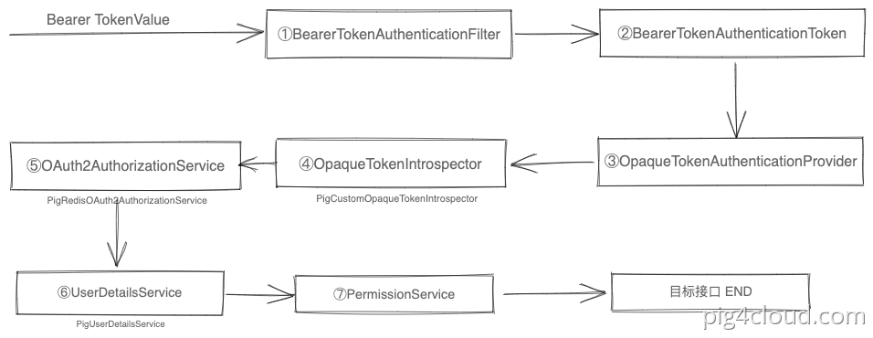
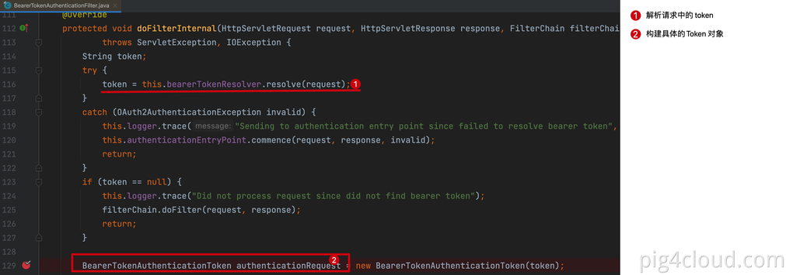
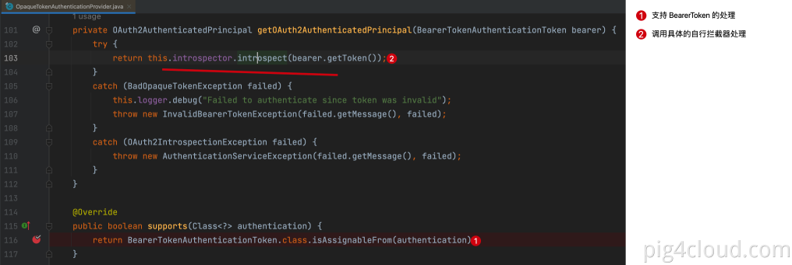
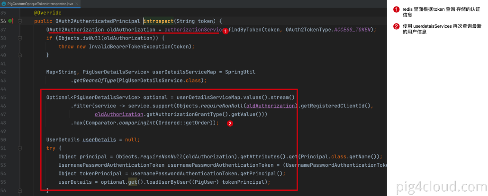
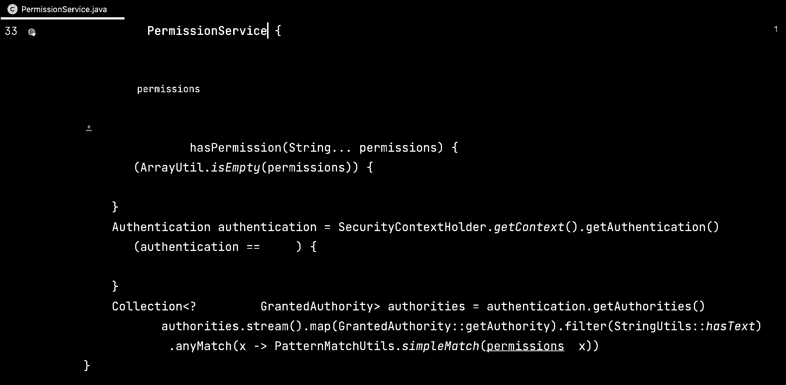
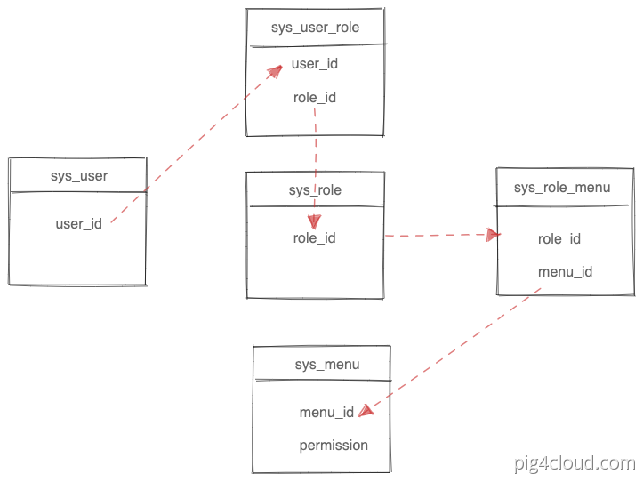

> 目前pig的权限控制是在方法上的，不支持在数据库动态配置，相当于方法上的权限是写死的，菜单表里添加permission字段对应这个菜单（按钮）的权限标识


> 当用户携带token 请求资源服务器的资源时,Spring Security 拦截token，进行token 和 userdetails 匹配过程，把无状态的token 转化成具体用户

## 1 Filter 拦截请求进行鉴
```
BearerTokenAuthenticationFilter 拦截所有资源服务器的请求，

解析 header 或者  参数中的 access_token 字段
根据access_token 构造出来 BearerTokenAuthenticationToken 认证对象
```


## 2 匹配自省鉴权处理器


## 3 调用自省拦截器实现处理
```
PigRedisOAuth2AuthorizationService 通过token value 查询 认证中心下发令牌时 存储的用户认证信息
根据用户认证信息 再次调用 PigUserDetailsService 查询数据库中的最新数据

避免 redis 存储旧数据，实现权限实时更新
```


## 4 接口进行权限判断
hasPermission权限判断
```
@GetMapping("/export")
@PreAuthorize("@pms.hasPermission('sys_user_import_export')")
public List<UserExcelVO> export(UserDTO userDTO) {
}
```


## 5 PIG 数据库权限模型
```
用户 1    角色N
角色  1   菜单（权限）N
```


