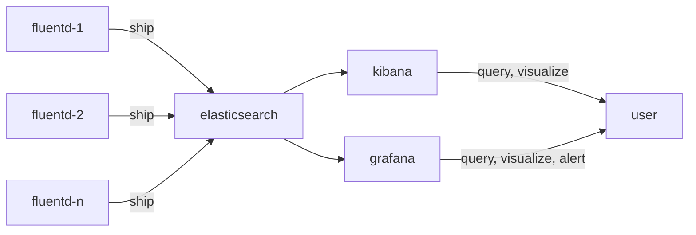

# log collect

Structure:



`ship` means collect, parse, filter, transform, and send logs.

## server

Build server: `bot-k8s` (`10.0.1.200`).

Collect and monitor server: `bot-monitor` (`10.0.1.121`).

Forward ssh ports in local:

```bash
ssh bot-monitor -N -L 3000:localhost:3000 -L 5601:localhost:5601 -L 9200:localhost:9200
```

Then access services:

- grafana web UI: [http://localhost:3000](http://localhost:3000), default user/passwd: `admin/admin`
- kibana web UI: [http://localhost:5601](http://localhost:5601)
- elasticsearch: [http://localhost:9200](http://localhost:9200)

## log source and target

Collect logs from `ruyi-core-deployment` to elasticsearch indices. Pods of this deployment run on various nodes.

The log file is mapped to path `/data/tomcat/logs/ruyi-api.log` on the running node.

NOTE: only collect log with keyword `Response2`.

To check log:

```shell
$ kubectl get pod | grep ruyi-core-deployment
ruyi-core-deployment-674f68f8c9-bdvzm                     1/1     Running   0          126m
ruyi-core-deployment-674f68f8c9-bthn7                     1/1     Running   0          145m
ruyi-core-deployment-674f68f8c9-dzlpf                     1/1     Running   0          130m
ruyi-core-deployment-674f68f8c9-h9d7t                     1/1     Running   0          149m
ruyi-core-deployment-674f68f8c9-jxq28                     1/1     Running   0          133m
ruyi-core-deployment-674f68f8c9-kfgdg                     1/1     Running   0          136m
ruyi-core-deployment-674f68f8c9-kn9d6                     1/1     Running   0          142m
ruyi-core-deployment-674f68f8c9-wxqgv                     1/1     Running   0          123m
ruyi-core-deployment-674f68f8c9-z9t4m                     1/1     Running   0          139m

$ kubectl describe pod ruyi-core-deployment-674f68f8c9-bdvzm | grep Node:
Node:           ip-10-0-1-210.cn-northwest-1.compute.internal/10.0.1.210

$ ssh 10.0.1.210

$ tail /data/tomcat/logs/ruyi-api.log
...
[ruyi-api-INFO 2022-01-28 13:34:24] com.haizhi.ruyi.api.service.impl.ElkServiceImpl.logResponse(ElkServiceImpl.java:233) | Response2 - {"msg_id":"1ba96b02-cbdf-4bb5-9086-da4b6d79dff7","text":"波澜壮阔","meta_process_milliseconds":59.0,"meta_nlp_process_milliseconds":20.0,"meta_action_process_milliseconds":35.0,"meta_action_invoke_process_milliseconds":6.0,"meta_action_js_process_milliseconds":29.0,"app_id":"b2c7cfc8-7e42-447d-ace9-c8712f75dd6a","user_id":"6aa68f7c6b21ff0fb8a9ae721205d7b56d7930c892114455a74688f2889ac8b2","session_id":"7a55bcdc-3ae1-4981-a558-055372f020a0","app_name":"华为-成语接龙","matching_app_id":"3a2eab0e-2992-4775-9c46-5d4ca86d7308","matching_app_name":"成语接龙","matching_intent_id":"bd181022-8308-49a4-80ae-4cf784783e4c","matching_intent_name":"玩成语接龙","matching_action_name":"sys.action.chengyujielong/play","matching_score":1.0,"matching_score_color":"c4","response":"{\"_text\":\"波澜壮阔\",\"msg_id\":\"1ba96b02-cbdf-4bb5-9086-da4b6d79dff7\",\"intents\":[{\"parameters\":{\"q\":\"波澜壮阔\",\"chengyuToMatch\":\"海不扬波\",\"score\":\"4\",\"msgNotChengyu\":\"这不是成语哦，请重新说一个成语，不想玩了可以跟我说【退出】\",\"msgNotMatch\":\"你没有接上我的成语，请再试试看呢？\",\"msgSysLose\":\"你好厉害，我认输！要不再来一局，这一次我一定会赢的。\",\"prevChengyu\":\"海不扬波\",\"totalNumUserSay\":\"16\",\"lastPinyin\":\"bo\",\"explanation\":\"比喻世道太平无忧。\",\"标签云\":\"你可以说:跳过,退出\",\"service\":\"chengyu\"},\"action\":\"sys.action.chengyujielong/play\",\"name\":\"玩成语接龙\",\"result\":{\"isChengyu\":true,\"isValidMatch\":true,\"chengyuToMatch\":\"阔步高谈\",\"explanation\":\"大步走路，高声谈论。\",\"lastPinyin\":\"tan\",\"score\":5,\"beatPercent\":10,\"totalNumUserSay\":17,\"prevChengyu\":\"海不扬波;阔步高谈\",\"text\":\"好的，该我接啦，我说：阔步高谈\",\"type\":\"dialog\"},\"outputs\":[{\"type\":\"wechat.text\",\"property\":{\"text\":\"这个成语我知道，赞一个，该我啦：阔步高谈\"}},{\"type\":\"dialog\",\"property\":{\"text\":\"这个成语我知道，赞一个，该我啦：阔步高谈\",\"emotion\":\"calm\"}}],\"score\":\"1.0\",\"scoreColor\":\"c4\",\"is_match\":1,\"skill_id\":\"3a2eab0e-2992-4775-9c46-5d4ca86d7308\",\"id\":\"bd181022-8308-49a4-80ae-4cf784783e4c\"}],\"meta_process_milliseconds\":59}"}
```

Target record of this message in elasticsearch index:

```json
{
  "_index": "logstash-2022.01.28",
  "_type": "fluentd",
  "_id": "AX6fLYqw79qqhEXbcsoi",
  "_score": 13.018864,
  "_source": {
    "@timestamp": "2022-01-28T05:34:24.873Z",
    "app_id": "b2c7cfc8-7e42-447d-ace9-c8712f75dd6a",
    "app_name": "华为-成语接龙",
    "hostname": "ip-10-0-1-210.cn-northwest-1.compute.internal",
    "log_timestamp": "2022-01-28T13:34:24",
    "logger": "ruyi-api-INFO",
    "matching_action_name": "sys.action.chengyujielong/play",
    "matching_app_id": "3a2eab0e-2992-4775-9c46-5d4ca86d7308",
    "matching_app_name": "成语接龙",
    "matching_intent_id": "bd181022-8308-49a4-80ae-4cf784783e4c",
    "matching_intent_name": "玩成语接龙",
    "matching_score": 1,
    "matching_score_color": "c4",
    "meta_action_invoke_process_milliseconds": 6,
    "meta_action_js_process_milliseconds": 29,
    "meta_action_process_milliseconds": 35,
    "meta_nlp_process_milliseconds": 20,
    "meta_process_milliseconds": 59,
    "msg_id": "1ba96b02-cbdf-4bb5-9086-da4b6d79dff7",
    "session_id": "7a55bcdc-3ae1-4981-a558-055372f020a0",
    "tag": "ruyi-api.response2.all",
    "text": "波澜壮阔",
    "user_id": "6aa68f7c6b21ff0fb8a9ae721205d7b56d7930c892114455a74688f2889ac8b2"
  }
}
```

## fluentd

Fluentd version: v1.7.0

### build docker image

Transfer file `fluentd/fluentd-daemonset.yaml` and contents in `fluentd/image` to `/root/fluentd/` on build server.

Build:

```shell
ssh bot-k8s
sudo -i
cd ~/fluentd

export image=fluentd-daemonset
export version=1.7.0-20200913
export registry=10.0.64.13:5000/dev

docker build --tag ${image}:${version} .
docker tag ${image}:${version} ${registry}/${image}:${version}
docker push ${registry}/${image}:${version}
```

### deploy

Deploy to all k8s nodes as daemonset:

```shell
ssh bot-k8s
sudo -i
cd ~/fluentd

kubectl apply -f fluentd-daemonset.yaml
```

It is deployed to namespace `kube-logging`. If no namespace, create it first: `kubectl create namespace kube-logging`.

### operation

k8s commands:

- list fluentd pods: `kubectl -n kube-logging get pod`
- get details of pod: `kubectl -n kube-logging describe pod $POD_NAME`
- get deploy node of pod: `kubectl -n kube-logging describe pod $POD_NAME | grep Node:`

docker commands:

- show detail of fluentd container: `sudo docker ps | grep fluentd-daemonset`
- connect to container: `sudo docker exec -it $CONTAINER_ID /bin/bash`

input related:

- source log path on each node: `/data/tomcat/logs/ruyi-api.log`
- pos file path on each node: `/var/log/ruyi-api.log.fluentd.pos`

output related:

- es indices:
  - janssen log: like `janssen-2022.01.28`
  - all log: like `logstash-2022.01.28`

## elasticsearch and kibana

### server setup

Check and set *mmap counts*:

- view current value: `sysctl vm.max_map_count`
- if need increase the limit to `262144`, run: `sudo sysctl -w vm.max_map_count=262144`

Refer to:

- [Elasticsearch, Logstash, Kibana (ELK) Docker image documentation / Prerequisites](https://elk-docker.readthedocs.io/#prerequisites)
- [Elasticsearch Reference [5.6] » Set up Elasticsearch » Important System Configuration » Virtual memory](https://www.elastic.co/guide/en/elasticsearch/reference/5.6/vm-max-map-count.html)

### deploy

Prepare folder:

```shell
ssh bot-monitor
sudo -i

mkdir -p /data/elk_5615/elasticsearch
chmod -R 777 /data/elk_5615/elasticsearch
```

Run (not using logstash):

```shell
docker run \
--detach \
--name elk_5615 \
-p 5601:5601 \
-p 9200:9200 \
-e LOGSTASH_START=0 \
-e ES_HEAP_SIZE="8g" \
-v /data/elk_5615/elasticsearch:/var/lib/elasticsearch \
sebp/elk:5615
```

Version of `sebp/elk` is 5.6.15.

Ports

- 5601: Kibana web interface
- 9200: Elasticsearch interface

For details, refer to: [Elasticsearch, Logstash, Kibana (ELK) Docker image documentation](https://elk-docker.readthedocs.io/).

## notes

### log timestamp

There are two timestamps in es record for log:

- `@timestamp`: in GMT with ms
- `log_timestamp`: in Beijing Time, no ms


# fluentd.conf配置日志格式

```conf
source>
 @type forward
 port 24224
 bind 0.0.0.0
 format multiline
 multiline_flush_interval 5s
 format_firstline /\d{4}-\d{1,2}-\d{1,2}/
 format1 /^(?<access_time>\d{2}:\d{2}:\d{2},\d{3}) (?<level>[^ ]*) (?<application>[^ ]*) \[(?<app_thread>.*)\] (?<message>.*)/
</source>

<match **>
@id elasticsearch
@type elasticsearch
index_name docker
type_name _doc
host 192.168.0.1
port 9200
include_tag_key true
tag_key @log_name
logstash_format true
flush_interval 10s
logstash_prefix docker
</match>
```
