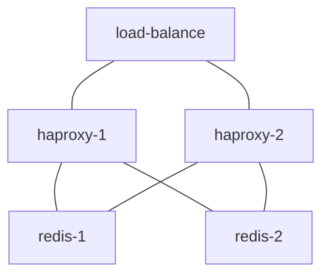

# redis and haproxy

Structure:




## server

Deployed on servers:
- `bot-redis-1`: `10.0.1.55`
- `bot-redis-1`: `10.0.1.156`

Forward ssh ports in local: 

```bash
ssh bot-redis-1 -N -L 1936:localhost:1936 -L 6379:localhost:6379 -L 6380:localhost:6380
```

Then access services:
- haproxy web UI: <http://localhost:1936/stats>
- redis: `redis-cli -h localhost -p 6379`
- redis via haproxy: `redis-cli -h localhost -p 6380`
- redis via AWS ELB (Elastic Load Balancing): `redis-cli -h ai-prod-redis-d894c73cd81127f8.elb.cn-northwest-1.amazonaws.com.cn -p 6379`


Paths:
- redis related: `/data/redis`
- haproxy related: `/data/haproxy`

Redis db backup:
- dst in s3: `s3://bot-redis-backup/backup/`, name like: `redis_2022-01-27.rdb`
- crontab task runs daily on 20:00 GMT (04:00 Beijing Time)
- only keep backups up to recent 7 days
- log path: `/data/redis/backup.log`


## redis

### install local redis utilities

Download [redis-5.0.14.tar.gz](https://download.redis.io/releases/redis-5.0.14.tar.gz) from [redis.io/download](https://redis.io/download) and build:

```bash
wget https://download.redis.io/releases/redis-5.0.14.tar.gz
tar xvzf redis-5.0.14.tar.gz
cd redis-5.0.14
make
cp src/redis-cli /usr/local/bin/
cp src/redis-benchmark /usr/local/bin/
```

Connect to local redis: `redis-cli`.

Connect to remote redis: `redis-cli -h HOST -p PORT`


### deploy

Prepare folder on *both servers*:

```bash
sudo mkdir -p /data/redis
sudo chown ec2-user:ec2-user /data/redis
cd /data/redis
mkdir data
```

Copy files in `redis/redis` to server, as structure:

```
/data/redis
├── data/
└── redis.conf
```

For daily redis backup, on server `bot-redis-1`:
- transfer `redis/bin/backup.sh` to `/data/redis/`, and make sure it is executable
- run: `crontab -e`
- add entry: `0 20 * * * /data/redis/backup_redis.sh >> /data/redis/backup.log`, which runs on 20:00 GMT (04:00 Beijing Time) each day
- review cron jobs: `crontab -l`


### run

Launch redis on `bot-redis-1`, run: 

```bash
sudo docker run \
--detach \
--name redis \
--network host \
--volume /data/redis/redis.conf:/usr/local/etc/redis/redis.conf \
--volume /data/redis/data:/data \
redis:5.0.14 \
redis-server /usr/local/etc/redis/redis.conf
```


Launch redis on `bot-redis-2` as replica, run: 

```bash
sudo docker run \
--detach \
--name redis \
--network host \
--volume /data/redis/redis.conf:/usr/local/etc/redis/redis.conf \
--volume /data/redis/data:/data \
redis:5.0.14 \
redis-server /usr/local/etc/redis/redis.conf --replicaof 10.0.1.55 6379
```


Check logs:

```bash
sudo docker logs redis
```

Check connection: `redis-cli`, then input: `info`


## haproxy

### deploy

Deploy haproxy on *both servers* for both redis services for easy usage and high availability.

```bash
sudo mkdir -p /data/haproxy
sudo chown ec2-user:ec2-user /data/haproxy
cd /data/haproxy
mkdir haproxy
```

Copy files in `redis/haproxy` to server, as structure:

```
/data/haproxy/haproxy
└── haproxy.cfg
```


### run

Launch haproxy on *both servers*, run: 

```bash
sudo docker run \
--detach \
--name haproxy \
--network host \
--volume /data/haproxy/haproxy:/usr/local/etc/haproxy:ro \
haproxy:2.5.1
```

Check haproxy web UI: <http://localhost:1936/stats>

Check connection: `redis-cli -h localhost -p 6380`


## load balancer

Create AWS ELB (Elastic Load Balancing) service for the two haproxy services.

Connect: `redis-cli -h ai-prod-redis-d894c73cd81127f8.elb.cn-northwest-1.amazonaws.com.cn -p 6379`


## operations

### server setup

For details of server setup, refer to *Redis setup hints* in [Redis Administration](https://redis.io/topics/admin).

Notably:
- make sure to set the Linux kernel overcommit memory setting to 1
- make sure Redis won't be affected by Linux kernel feature *transparent huge pages*
- set an explicit `maxmemory` option

For hardware resources, if max memory usage be `redis_max_mem`, then typical requirements:
- server memory: `redis_max_mem` * 2.5
- server disk: `redis_max_mem` * 6

For details, refer to: [Redis Enterprise Software > Administration > Planning your Cluster Deployment > Hardware requirements](https://docs.redis.com/latest/rs/administering/designing-production/hardware-requirements/).


### benchmark

Run:

```bash
redis-benchmark \
-h ai-prod-redis-d894c73cd81127f8.elb.cn-northwest-1.amazonaws.com.cn \
-p 6379 \
-n 100000 \
-d 100 \
-q \
--csv
```

NOTE (details refer to [How fast is Redis?](https://redis.io/topics/benchmarks)): 

```
Usage: redis-benchmark 

 -h <hostname>      Server hostname (default 127.0.0.1)
 -p <port>          Server port (default 6379)
 -c <clients>       Number of parallel connections (default 50)
 -n <requests>      Total number of requests (default 100000)
 -d <size>          Data size of SET/GET value in bytes (default 2)
 -q                 Quiet. Just show query/sec values
 --csv              Output in CSV format
 ...
```

Result:

| test                               |    req/s |
|------------------------------------|---------:|
| PING_INLINE                        | 51308.36 |
| PING_BULK                          | 49751.24 |
| SET                                | 49212.60 |
| GET                                | 54824.56 |
| INCR                               | 46253.47 |
| LPUSH                              | 43610.99 |
| RPUSH                              | 46860.36 |
| LPOP                               | 45892.61 |
| RPOP                               | 41771.09 |
| SADD                               | 51894.13 |
| HSET                               | 48169.56 |
| SPOP                               | 55248.62 |
| LPUSH (needed to benchmark LRANGE) | 49751.24 |
| LRANGE_100 (first 100 elements)    | 23702.30 |
| LRANGE_300 (first 300 elements)    | 10735.37 |
| LRANGE_500 (first 450 elements)    |  7936.51 |
| LRANGE_600 (first 600 elements)    |  5614.51 |
| MSET (10 keys)                     | 38066.23 |


### migration

To migrate from Amazon ElastiCache redis to redis on EC2. Assume to merge multiple ElastiCache redis instances into one on EC2.

First dump ElastiCache redis to multiple `rdb` files on s3.

Then download them to `bot-redis-1`:

```bash
cd /data/redis/rdb
aws s3 cp s3://bot-redis-backup/redis_1.rdb .
aws s3 cp s3://bot-redis-backup/redis_2.rdb .
```

Stop redis on both `bot-redis-1` and `bot-redis-2`.

On `bot-redis-1`, merge multiple `rdb` files into one `dump.rdb`.

First place all `.rdb` files (*do not* name any as `dump.rdb`) in `/data/redis/rdb/`, then run tool [redis-rdb-cli](https://github.com/leonchen83/redis-rdb-cli):

```bash
sudo docker run \
-it \
--rm \
--volume /data/redis/rdb:/app/redis-rdb-cli/rdb \
redisrdbcli/redis-rdb-cli:v0.7.4 \
rdt -m ./rdb/*.rdb -o ./rdb/dump.rdb
```

The merged rdb file is: `/data/redis/rdb/dump.rdb`.


On `bot-redis-1`:
- move merged rdb file:

    ```bash
    cd /data/redis/data/
    rm *
    mv /data/redis/rdb/dump.rdb .
    ```

- launch redis with option `--appendonly no`

    ```bash
    sudo docker run \
    --detach \
    --name redis \
    --network host \
    --volume /data/redis/redis.conf:/usr/local/etc/redis/redis.conf \
    --volume /data/redis/data:/data \
    redis:5.0.14 \
    redis-server /usr/local/etc/redis/redis.conf --appendonly no
    ```

- run `redis-cli info persistence | grep loading:` several times to wait for `loading:0`
- run `redis-cli config set appendonly yes`
- run `redis-cli info persistence | grep aof_rewrite_in_progress:` several times to wait for `aof_rewrite_in_progress:0`
- check file `appendonly.aof` is written completely
- stop redis:

    ```bash
    sudo docker ps | grep redis
    sudo docker rm -f $CONTAINER
    ```


On `bot-redis-1`, launch redis as master:

```bash
sudo docker run \
--detach \
--name redis \
--network host \
--volume /data/redis/redis.conf:/usr/local/etc/redis/redis.conf \
--volume /data/redis/data:/data \
redis:5.0.14 \
redis-server /usr/local/etc/redis/redis.conf
```

On `bot-redis-2`, launch redis as replica of redis on `bot-redis-1`:

```bash
sudo docker run \
--detach \
--name redis \
--network host \
--volume /data/redis/redis.conf:/usr/local/etc/redis/redis.conf \
--volume /data/redis/data:/data \
redis:5.0.14 \
redis-server /usr/local/etc/redis/redis.conf --replicaof 10.0.1.55 6379
```


### manual failover

If replica redis fails, just restart it as replica of master.

If master redis fails, need manual failover:
- on replica server, start `redis-cli`, and issue command `replicaof no one` to make it the new master.
- on failed previous master server, launch redis as replica of the new master.


### server restart

If restart is needed for the two servers:
- stop redis1
- change redis2 to master
- restart redis1 server
- start redis1 as replica of redis2, wait for sync to finish
- stop redis2
- change redis1 to master
- restart redis2 server
- start redis2 as replica of redis1


## notes

### haproxy connect error

Connect haproxy service from `redis-cli` with following config may trigger error: `Error: Server closed the connection`

```
defaults REDIS
    mode tcp
    timeout connect 5s
    timeout server 5s
    timeout client 5s
    option log-health-checks
```

To fix, simply enlarge server and client timeout (e.g.: to 30h) like in `haproxy/haproxy.cfg`.

Refer to: [HAProxy + pgbouncer server closed the connection unexpectedly](https://stackoverflow.com/questions/40762458/haproxy-pgbouncer-server-closed-the-connection-unexpectedly)


### migration from Amazon ElastiCache redis to redis on EC2

It is not feasible to create a redis on EC2 as replica of existing ElastiCache redis.

It will show error:

```
1:S 18 Jan 2022 06:19:35.319 * Retrying with SYNC...
1:S 18 Jan 2022 06:19:35.319 # MASTER aborted replication with an error: ERR unknown command `SYNC`, with args beginning with:
1:S 18 Jan 2022 06:19:36.319 * Connecting to MASTER ai-prod-redis-kg.gr0jlk.ng.0001.cnw1.cache.amazonaws.com.cn:6379
1:S 18 Jan 2022 06:19:36.320 * MASTER <-> REPLICA sync started
1:S 18 Jan 2022 06:19:36.320 * Non blocking connect for SYNC fired the event.
1:S 18 Jan 2022 06:19:36.321 * Master replied to PING, replication can continue...
1:S 18 Jan 2022 06:19:36.321 * Partial resynchronization not possible (no cached master)
1:S 18 Jan 2022 06:19:36.322 * Master does not support PSYNC or is in error state (reply: -ERR unknown command `PSYNC`, with args beginning with: `?`, `-1`, )
```

Root cause is that `sync` is restricted. Refer to: [Amazon ElastiCache / User Guide / Restricted Redis Commands](https://docs.aws.amazon.com/AmazonElastiCache/latest/red-ug/RestrictedCommands.html).


### rdb file not updating

Redis should enable `save` by default per [redis.conf for Redis 5.0](https://raw.githubusercontent.com/redis/redis/5.0/redis.conf):

```
################################ SNAPSHOTTING  ################################
#
# Save the DB on disk:
#
#   save <seconds> <changes>
#
#   Will save the DB if both the given number of seconds and the given
#   number of write operations against the DB occurred.
#
#   In the example below the behaviour will be to save:
#   after 900 sec (15 min) if at least 1 key changed
#   after 300 sec (5 min) if at least 10 keys changed
#   after 60 sec if at least 10000 keys changed
#
#   Note: you can disable saving completely by commenting out all "save" lines.
#
#   It is also possible to remove all the previously configured save
#   points by adding a save directive with a single empty string argument
#   like in the following example:
#
#   save ""

save 900 1
save 300 10
save 60 10000
```

However, conf `save` is empty:

```shell
$ redis-cli CONFIG GET save
1) "save"
2) ""
```

To fix, manually set:

```shell
redis-cli config set save "1800 1 900 1000"
```

And add entries in `redis.conf`:

```
save 1800 1
save 900 1000
```


## references

Docs:
- [Redis configuration](https://redis.io/topics/config)
- [redis.conf for Redis 5.0](https://raw.githubusercontent.com/redis/redis/5.0/redis.conf)
- [Redis Administration](https://redis.io/topics/admin)
- [Redis high availability deployment with HAProxy on Oracle Cloud Infrastructure](https://blogs.oracle.com/cloud-infrastructure/post/deploying-highly-available-redis-replication-with-haproxy-on-oracle-cloud-infrastructure)
- [redis-rdb-cli](https://github.com/leonchen83/redis-rdb-cli)


